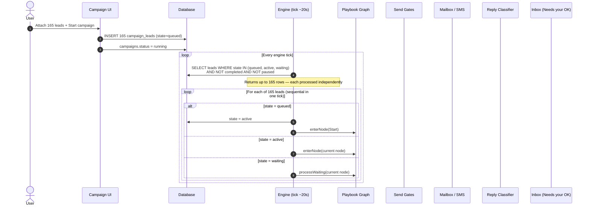
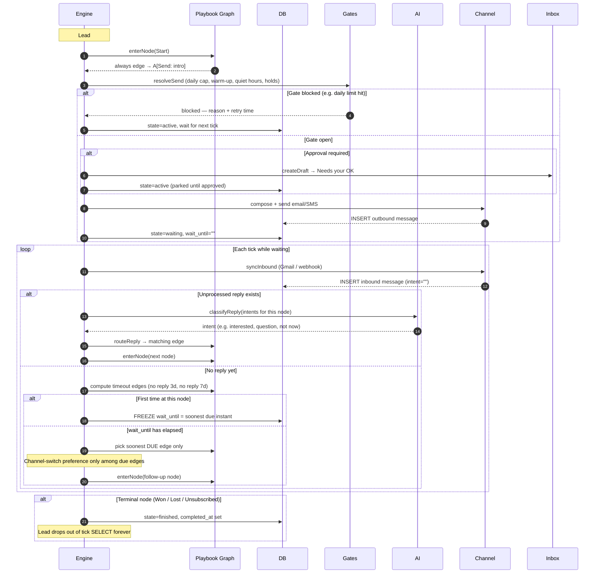
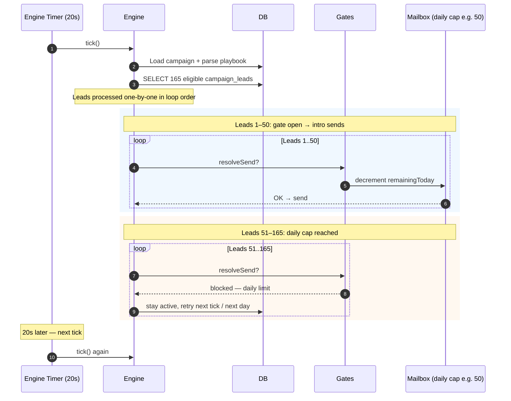
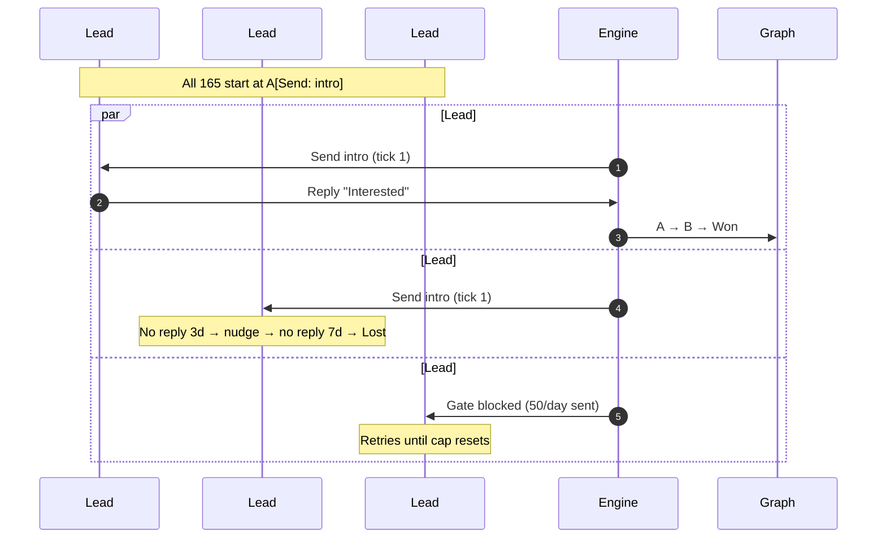
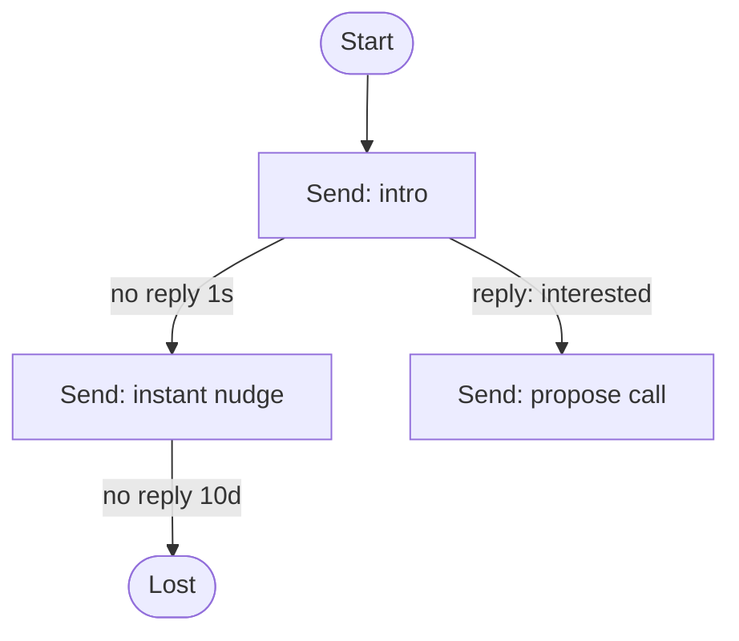

# Campaign Graph — 165-Lead Navigation Assessment

**Date:** 2026-09-04  
**Scope:** How 165 enrolled leads navigate through the campaign playbook graph; timing flexibility (1 second → 10 days); assessment against the self-healing UX brain architecture.  
**Related:** [AUDIT-CAMPAIGN-GRAPH-2026-09-04.md](./AUDIT-CAMPAIGN-GRAPH-2026-09-04.md) (engine bugs), [campaigns/playbook-workflow-test-plan.md](./campaigns/playbook-workflow-test-plan.md) (rehearsal guide)  
**UX reference:** Self-healing UX brain architecture (v2 mermaid self-healing ux)

**Status:** Assessment only — no code changed. For other agents to review, challenge, and triage.

---

## Executive summary

- **165 leads = 165 independent graph traversals.** Each `campaign_leads` row has its own `node_id`, `state`, `wait_until`, and branch history.
- **They do not all move at once.** Shared send gates (daily cap, 45s minimum gap, working hours, approval) serialize outbound across the fleet.
- **Playbook timing supports 1s → 10d in Mermaid**, but production mailboxes enforce ~45s minimum outbound spacing and ~20s engine tick resolution.
- **Four live engine bugs** (from the campaign-graph audit) can break timing, human intent, and channel-switch ladders at scale.
- **Against the self-healing UX plan:** strongest on graph-as-truth and recoverable pause; weakest on waiting narration at fleet scale and diagram-vs-engine fidelity.

---

## 1. Overview — 165 leads in one running campaign



### Key code paths

| Piece | File | Role |
|-------|------|------|
| Tick loop | `server/engine.js` → `tick()`, `processCampaign()` | Every ~20s; loads all eligible leads |
| Lead selection | `server/engine.js:1483–1490` | `queued`, `active`, `waiting`; excludes `completed_at`, paused |
| Graph walk | `enterNode()`, `processWaiting()`, `routeReply()` | Send, wait, classify, branch |
| Playbook parse | `server/playbook.js` | Mermaid → nodes + edges + durations |
| Send gates | `server/gates.js`, `server/pacing.js` | Cap, hours, gap, holds |
| Step timing | `server/step-timing.js` | `wait_until` freeze, random windows |

---

## 2. Per-lead journey through the graph (intended behavior)

Each of the 165 leads is its own traversal. They share gates but **never share timers or branches**.



### Node types

| Node type | Engine action | Next state |
|-----------|---------------|------------|
| **Start** | Follow `always` edge immediately | Recurse to next node |
| **Send** | Gate → (approval?) → compose → send | `waiting` at same node |
| **Decision** | Park and wait for reply or timeout | `waiting` |
| **Wait** | Freeze `wait_until` from delay | `waiting` until time elapses |
| **Terminal** | `finishLead` — Won / Lost / Unsubscribed | Excluded from future ticks |

### Branching rules while `waiting`

1. **Reply wins over timeout** — inbound synced and classified first.
2. **Timeouts are frozen** — `wait_until` set once; playbook edits do not move a lead already waiting.
3. **Soonest due edge fires** — `no reply 3d` before `no reply 7d`.
4. **Channel switch is a preference among due edges** — SMS switch only when that edge's timer has elapsed.
5. **Hop budget** — max 10 node transitions per lead per tick; loops park as `needs_attention`.

---

## 3. How 165 leads compete in a single tick



### Concrete outcome (real mailbox, not sandbox)

| Factor | Effect on 165 leads |
|--------|---------------------|
| **Daily send cap** (e.g. 50/day) | ~115 leads get nothing on day 1; queue until cap resets |
| **45s minimum gap** (`server/pacing.js` `MIN_GAP_MS`) | Outbound spacing ≥45s per mailbox regardless of playbook `no reply 1s` |
| **20s engine tick** | Timers under ~20s fire on next tick, not exact second |
| **Working hours** (default 08:30–17:30) | Sends outside window wait |
| **Approval on** | Each send → Inbox Needs your OK; 165 intros = 165 approvals |

---

## 4. Scenario walkthrough — cap 50/day, `no reply 3d` → nudge

| Day | What happens |
|-----|----------------|
| **0 — Start** | Leads 1–50: intro sends (~45s apart ≈ 37 min). Leads 51–165: blocked by cap. |
| **0–3** | Repliers branch independently. Silent leads freeze `wait_until` at day 3. |
| **1** | Cap resets; leads 51–100 get intros. Repeat until all 165 touched (~4 days at cap 50). |
| **3** | First cohort's 3-day timers elapse → nudge (if cap allows). **Bug risk:** undue-pool may fire SMS switch early. |
| **Ongoing** | Each lead on its own branch; human corrections may be overwritten (intent guard bug). |

### Example — three leads, diverging paths



---

## 5. Timing flexibility — 1 second to 10 days

### Requirement

Operators need flexibility to set **time between messages** (no-reply / wait) from **1 second** to **10 days**.

### What the engine supports today

| Layer | 1 second | 10 days | Notes |
|-------|----------|---------|-------|
| **Playbook Mermaid** (`no reply 1s`, `Wait: 10d`) | ✅ Parsed | ✅ Parsed | `parseDuration` in `server/playbook.js` — `s` through `w` |
| **Engine tick resolution** | ⚠️ ~20s floor | ✅ | See playbook-workflow-test-plan.md |
| **Real mailbox pacing** | ❌ ~45s min gap | ✅ | `MIN_GAP_MS = 45_000` in `server/pacing.js` |
| **Sandbox mailbox** | ✅ ~20s floor only | ✅ | Ignores pacing and hours |
| **Behaviour settings UI** | ❌ | ✅ (days/hours) | `web/src/campaigns/SettingsPanel.jsx` — no seconds/minutes |
| **Behaviour `timeoutMs` override** | ⚠️ | ⚠️ | If set, **replaces every `no reply` edge** on that channel |

### Example playbook spanning the range



- **Sandbox rehearsal:** `1s` → ~20s actual; `10d` is real.
- **Production mailbox:** `1s` edge is overridden by 45s pacing + daily cap spreading 165 intros over days.

### When the prospect replies (not a no-reply wait)

There is **no authored delay** before the next outbound after a reply:

1. Inbound arrives (webhook or sync on tick).
2. Next tick (~20s max) classifies intent.
3. Engine branches and may send immediately (if gate open).

Expect **~20–40s + AI latency**, not a configurable 1s–10d “wait before auto-reply.”

### Parser units (verified)

From `server/playbook.js`:

```
s | sec | secs | second | seconds
m | min | mins | minute | minutes
h | hr | hrs | hour | hours
d | day | days
w | week | weeks
```

Cheatsheet in `web/src/pages/CampaignDetail.jsx`: `30s · 5m · 2h · 3d · 1w`.

---

## 6. Assessment against self-healing UX brain architecture

Reference: v2 mermaid self-healing UX — serial spine, predictive coding loop, H-code error taxonomy.

### Aligned

| UX principle | How the engine matches |
|--------------|-------------------------|
| **M7 — don't make them remember** | `node_id`, `state`, `wait_until` on each lead; graph is source of truth |
| **CSTA — interruption recoverable** | Pause/resume, manual intent routing, approval gate |
| **DGN — deliberate degeneracy** | Gates stack: cap + hours + approval + suppression |
| **One voice per moment** | One outbound per gate-open slot; hop budget stops runaway loops |

### Gaps — what goes wrong at 165 leads

| H-code | Finding | Operator / prospect experience |
|--------|---------|--------------------------------|
| **H6 — waiting without narration** | No fleet-level “next touch in X”; cap-blocked leads lack row-level reason | “Why hasn't lead #143 been emailed?” |
| **H5 — action gives no echo** | Daily cap mid-tick: leads 51–165 get no activity event that turn | Looks stuck; only campaign header hints why |
| **H9 — demands memory** | Behaviour `timeoutMs` overrides playbook ladder | Diagram says 3d + 7d; engine uses one duration |
| **H7 — error blames customer** | SMS campaign + email node → `Cannot read properties of null` | Raw JS in `error` state |
| **H15 — interruption unrecoverable** | `parseDbTime` bug → human intent never sticks | Inbox triage overridden on next tick |
| **H6** (timing) | `pickNoReplyEdge` undue-pool fallback | SMS switch fires days early |
| **H8 — same job two ways** | Sticky `step_send_slots` on revisit | Re-loop skips authored window |
| **H14 — empty state** | No pre-launch “165 × cap = intros done by date X” | Launch blind to throughput |

### Brain-layer summary

```
L0 Evidence     — Activity trail per lead; no fleet timing dashboard
L1 Prediction   — Operator expects diagram = reality; behaviour override breaks that
CECH / GFB      — Waiting states under-narrated at 165-lead scale
CERR            — Engine errors leak as JS strings
L5 Closure      — Cannot prove "all 165 followed authored graph" without manual audit
```

---

## 7. Known engine bugs (from campaign-graph audit)

These affect 165-lead runs in production. Full detail in [AUDIT-CAMPAIGN-GRAPH-2026-09-04.md](./AUDIT-CAMPAIGN-GRAPH-2026-09-04.md).

| # | Bug | Wrong behavior | Correct behavior |
|---|-----|----------------|------------------|
| 1 | Undue-pool in `pickNoReplyEdge` | SMS switch at day 3 when adaptive timing shifts dues | Only pick edges where `at <= now`; else re-freeze `wait_until` |
| 2 | `parseDbTime` + ISO `intent_set_at` | Human intent guard never runs | Human correction after message wins over classifier |
| 3 | Sticky `step_send_slots` | Revisited nodes skip send windows | Fresh slot per visit |
| 4 | New email node on SMS campaign | `mailbox.id` TypeError → terminal `error` | Block at save; readable error if reached |
| 5 | Silent permanent hangs | Empty `wait_until`, decision before first outbound, wait edges ignored | Freeze or reject at parse |
| 6 | Newest-first unclassified replies | One human interaction → two branches | Oldest-first or stamp all on route |

---

## 8. Gaps to close for true 1s → 10d flexibility

| Requirement | Status | Suggested fix |
|-------------|--------|---------------|
| Playbook accepts `1s` … `10d` | ✅ Done | — |
| Sub-20s timers fire precisely | ⚠️ Tick-bound | Trigger tick on inbound / `wait_until` elapse |
| Sub-45s outbound when authored | ❌ Pacing wins | Campaign flag: honour playbook timing (sandbox already does) |
| Behaviour UI: seconds/minutes | ❌ Days/hours only | Add units to Settings panel |
| Ladder + behaviour timeout coexist | ❌ Override flattens | Scale edges, don't replace; or document as exclusive |
| 165-lead throughput visible pre-launch | ❌ Missing | Schedule projection: “all intros by date X at current cap” |
| Row-level “why waiting” | ❌ Partial | Surface gate reason on each lead in Leads panel |

---

## 9. Questions for reviewing agents

Please assess and return:

1. **Throughput model** — Is the cap-50/day × 165-lead walkthrough correct? What did we miss (multi-mailbox rotation, warm-up ramp)?
2. **Timing contract** — Should “1s–10d flexibility” mean playbook-only, or must production honour sub-45s outbound when authored?
3. **UX H-codes** — Which gaps are P0 for a 165-lead launch vs acceptable for v1?
4. **Bug triage** — Agree on severity order of findings 1–6 for a live campaign with email→SMS switch ladder?
5. **Behaviour override** — Is flattening `no reply 3d` + `no reply 7d` to one `timeoutMs` intended? If yes, where should the UI say so?
6. **Reply latency** — Do we need a configurable “wait before auto-reply” (separate from no-reply edges)?
7. **Evidence bundle (L0)** — What screenshots/states must exist to audit this flow per the self-healing UX plan?

---

## 10. Test commands (for agents verifying claims)

```bash
# Graph-related suites (55 tests on clean HEAD per audit)
npm test -- --test-path-pattern="playbook|engine|step-timing|intents-engine"

# Duration parsing
node -e "import { parseDuration } from './server/playbook.js'; console.log(parseDuration('1s'), parseDuration('10d'))"
```

---

## 11. Bottom line

- **Graph navigation for 165 leads works as designed** — independent state machines, one tick, shared gates.
- **1s–10d is supported in playbook text**; **production enforces ~45s min outbound + ~20s tick + daily cap**.
- **Self-healing UX:** strongest on graph-as-truth; weakest on fleet-scale waiting narration and diagram-vs-engine fidelity.
- **Four+ live bugs** can break timing ladders, human triage, and channel switches during a 165-lead run.

---

*Generated for multi-agent review. Challenge any claim by tracing `server/engine.js`, `server/playbook.js`, `server/pacing.js`, and `server/step-timing.js`.*
