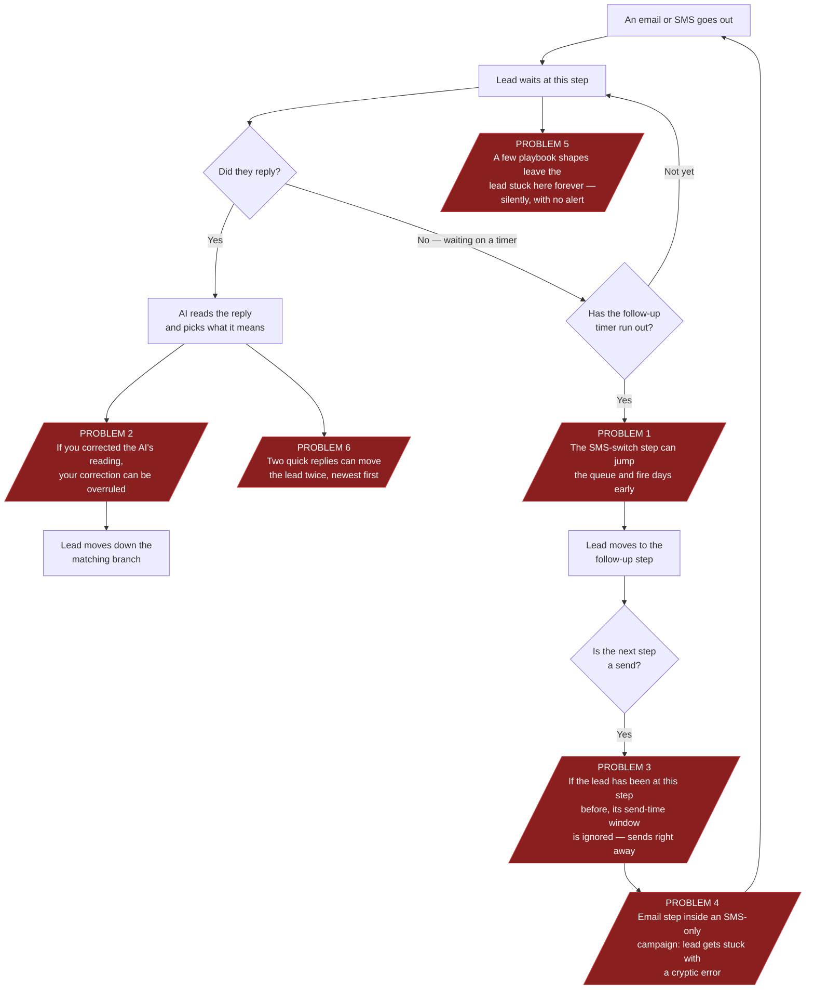
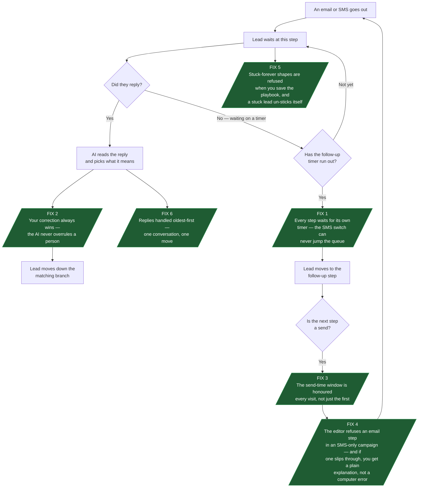

# Campaign Playbook — What Happens Today vs What Will Happen After the Fixes

A plain-language map of how a lead moves through a campaign playbook, showing
the six problems we found and how each one will behave once fixed.
**Red = broken today. Green = how it will work after the fix.** Everything
else stays exactly as it is.

## The six problems, in one sentence each

1. **The "switch to SMS" step can fire days too early.** A lead who was
   supposed to get an email follow-up on day 3 and an SMS on day 7 can get the
   SMS on day 3 — and never get the email at all.
2. **Your corrections don't stick.** When you re-label a reply the AI misread
   (say it called "ok thanks" an unsubscribe), the AI can quietly overrule you
   on the next pass and route the lead its own way.
3. **Send-time windows get skipped on repeat visits.** If a playbook loops a
   lead back to a step with a "send between 9:00–11:00" window, the second
   visit ignores the window and sends immediately.
4. **Adding an email step to an SMS-only campaign breaks it.** The editor lets
   you save it, and every lead who reaches that step gets stuck with a cryptic
   computer error instead of a clear message.
5. **Some playbook shapes make leads wait forever, silently.** No email, no
   error, no alert — the lead just sits there and nobody is told.
6. **Two quick replies can move a lead twice.** If someone sends two messages
   close together, the playbook can branch once for each — in the wrong order.

---

## Today: how a lead moves through the playbook

---

## After the fixes: the same journey, working properly

---

## What does NOT change

The audit confirmed all of this works correctly today, and the fixes leave it
alone:

- Editing a playbook never disturbs a lead already mid-wait.
- Runaway loops are stopped (a lead can never be emailed endlessly).
- Unsubscribes always win over every other rule.
- The AI can *suggest* someone wants to unsubscribe but can never act on it —
  only a person or the recipient's own click can.
- A conversation always keeps the same sender address, and mailbox rotation
  spreads volume properly.
- Temporary failures (a Gmail hiccup, a network blip) retry on their own.

## Suggested order of work

| Order | Fix | Why this order |
|-------|-----|----------------|
| 1st | #2 corrections stick, #6 one reply = one move | Tiny changes, protect the human's work first |
| 2nd | #1 SMS switch can't jump the queue | The worst thing a real lead could experience |
| 3rd | #3 windows honoured every visit | Timing correctness |
| 4th | #4 email-step-in-SMS-campaign refused | Stops a stranding error at the door |
| 5th | #5 stuck-forever shapes refused / self-heal | Broadest change (editor + engine) |

## For developers — where each fix lands

| # | Fix | Files |
|---|-----|-------|
| 1 | Only fire edges whose own timer elapsed; if none are due, re-schedule instead of firing early | `server/engine.js` (`pickNoReplyEdge`, `processWaiting`) |
| 2 | Make `parseDbTime` handle ISO timestamps (returns NaN today, killing the human-override guard) | `server/engine.js:38` |
| 3 | Invalidate the sticky step slot when a step fires, so a revisit rolls a fresh in-window time | `server/step-timing.js` |
| 4 | Re-check channel-mode vs send-node channels on every playbook save; null-guard the mailbox in the engine's email branch | `server/parity/campaigns.js`, `server/engine.js` |
| 5 | Parser rejects labeled edges off wait/start nodes and decisions before any send; engine self-heals an empty wait clock and falls back to enrolment time for timers | `server/playbook.js`, `server/engine.js` |
| 6 | Classify unprocessed replies oldest-first | `server/engine.js:1302` |

Full technical detail: [AUDIT-CAMPAIGN-GRAPH-2026-09-04.md](./AUDIT-CAMPAIGN-GRAPH-2026-09-04.md).
Hands-on regression rehearsals for #1, #2, #6: cases 16–18 in the
[playbook workflow test plan](./campaigns/playbook-workflow-test-plan.md).
