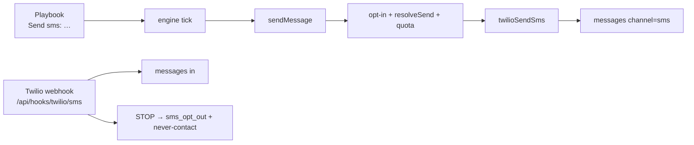

# Plan: Twilio SMS go-live + multi-channel follow-on

Parent strategy: [Docs/messaging-channels-plan.md](../messaging-channels-plan.md)  
Credentials: `.env` → `TWILIO_ACCOUNT_SID`, `TWILIO_AUTH_TOKEN` (+ From number / Messaging Service)

---

## Verdict

**SMS Phase 0–1 is largely already built.** Do not rebuild the adapter layer. This plan is: (1) finish production wiring for Twilio SMS, (2) close product gaps so operators can use it end-to-end, (3) sequence WhatsApp / Telegram / voice / unified-inbox later without rewriting campaigns.

---

## Already shipped (do not re-implement)

| Area | Where |
|------|--------|
| Env + health | `server/env.js` (`TWILIO_*`, `twilioEnvConfigured`) |
| Schema | `channel_accounts`, `campaign_channel_accounts`, `messages.channel`, lead `phone` + `sms_opt_*` |
| Transport | `server/channels/twilio.js` (send, signature, STOP keywords) |
| Façade | `server/channels/send.js` (`sendMessage` → email or SMS) |
| Compose | `server/channels/compose.js` |
| E.164 | `server/channels/phone.js` |
| Webhook | `POST /api/hooks/twilio/sms` in `server/channels/webhook.js` |
| Engine | `server/engine.js` uses `sendMessage` + `node.channel` |
| Playbook | `Send sms:` parsed in `server/playbook.js` |
| API / Settings | `server/parity/channels.js`, `web/src/settings/ChannelsSection.jsx` |
| Tests | `tests/channels-sms.test.js` |

---

## Goal for this plan

A workspace can:

1. **Pick a campaign type at create time** (Email, SMS, or Email + SMS) — this drives which senders and playbook defaults are required.
2. Connect Twilio (env auto-connect **or** Settings → Connections → Messages).
3. Opt-in a lead’s phone; attach the right sender(s) for that type.
4. Run playbook steps for the chosen channel(s) through the existing engine / approval path.
5. Receive inbound SMS + STOP → permanent opt-out.
6. See SMS in Inbox well enough to reply (channel-aware, not email-only UI).

Out of scope for SMS go-live: WhatsApp templates, Telegram, buying numbers in-app, Harry Call Router / Squad voice (separate phase).

---

## Architecture (reuse)

Email stays on `mailboxes`. SMS stays on `channel_accounts`. Campaigns attach both.

---

## Phase A — Twilio account ready (ops, no code)

**Acceptance**

- [ ] Trial/live Twilio account with SID + Auth Token in `.env` (done).
- [ ] `TWILIO_FROM_NUMBER` **or** `TWILIO_MESSAGING_SERVICE_SID` set (required for real sends; env health checks this).
- [ ] Twilio Console → Phone number → Messaging webhook:  
  `{APP_URL}/api/hooks/twilio/sms` (POST).  
  Local: ngrok/tunnel to `PORT` (8130), not Vite.
- [ ] Trial: destination numbers verified in Twilio Console.
- [ ] Production: `TWILIO_SKIP_SIGNATURE` unset / not `1`.
- [ ] Render (or host) has the same `TWILIO_*` secrets as local.

**Decision (lock now)**

| Decision | Recommendation |
|----------|----------------|
| Shared workspace Twilio vs per-client subaccounts | **Shared account for v1**; subaccounts later if agency isolation needed |
| From number vs Messaging Service | Prefer **Messaging Service** for AU scale; From number is fine for trial |
| Approval for SMS | Same as email (`require_approval` applies) |

---

## Phase B — Product gaps to close SMS E2E

These are the remaining build items for “operators can use SMS,” not greenfield Twilio.

### B0 — Campaign type at create (primary UX)

**Gap:** `CreateCampaignModal` only asks for a name (`POST /api/campaigns/create`). Operators never declare whether the campaign is email, SMS, or both — so readiness, playbook starter, and sender panels stay email-shaped.

**Product rule**

On **New campaign**, require a **campaign type** before create.

**v1 types (locked):** Email, SMS, and **Email + SMS** (`multi`). WhatsApp and Telegram stay later — no create options for those yet.

| Type | Value | Required senders to launch | Playbook default | Lead address |
|------|--------|----------------------------|------------------|--------------|
| **Email** | `email` | ≥1 mailbox | Starter with `Send:` / `Send email:` | email |
| **SMS** | `sms` | ≥1 SMS channel account | Starter with `Send sms:` | phone + SMS opt-in |
| **Email + SMS** | `multi` | ≥1 mailbox **and** ≥1 SMS account | Starter with email then SMS | email + phone/opt-in as steps need |

**Data**

- Store on campaign, e.g. `campaigns.channel_mode TEXT NOT NULL DEFAULT 'email'` with values `email` | `sms` | `multi`.
- Migration + backfill: existing rows → `email`.
- Create API: `POST /api/campaigns/create` accepts `{ name, channelMode }` (required from UI; default `email` for API/Goals compatibility).
- Response and list/detail include `channelMode` so UI can badge cards and gate readiness.
- Reject unknown modes (`whatsapp`, `telegram`, …) with 422 until those phases ship.

**UI — create modal**

1. Name (as today).
2. **Campaign type** — three choices: **Email**, **SMS**, **Email + SMS**.
3. Short helper under the choice: what you’ll attach next.
4. Create → navigate to detail as today.

**UI — after create (driven by type)**

- Readiness strip adapts:
  - `email` → playbook, mailbox, leads (current).
  - `sms` → playbook, SMS account, leads with phone/opt-in.
  - `multi` → playbook, mailbox, SMS account, leads.
- **Sending from** tab shows mailboxes and/or SMS senders for the mode (`multi` shows both attach panels).
- List card shows a small type badge (Email / SMS / Email + SMS).

**Launch rules**

- `sms` campaigns must **not** require a mailbox; must have ≥1 SMS channel account.
- `email` campaigns must **not** require an SMS account; must have ≥1 mailbox.
- `multi` requires both sender kinds; playbook may mix `Send email:` and `Send sms:` nodes.
- If playbook contains a channel the mode forbids, **block launch + explain** — do not auto-upgrade.

**Files (likely)**

- `web/src/pages/Campaigns.jsx` (`CreateCampaignModal`)
- `server/parity/campaigns.js` (create + serialize)
- `server/parity/schema.js` / migrations (`channel_mode`)
- Campaign detail readiness + `MailboxesPanel` counterpart for SMS
- `Docs/campaigns/create.md` — update acceptance (type required in UI)

**Acceptance**

- [ ] Create modal cannot submit without a selected type (Email, SMS, or Email + SMS).
- [ ] New SMS campaign launches with only SMS account + valid playbook + opted-in phones (no mailbox).
- [ ] New email campaign unchanged from today aside from explicit type.
- [ ] Multi requires both a mailbox and an SMS account before launch; Sending from shows both attach UIs.
- [ ] WhatsApp / Telegram are not offered in create.
- [ ] Existing campaigns behave as `email`.

### B1 — Campaign attach SMS sender (UI)

**Gap:** API supports `campaign_channel_accounts`; campaign UI does not yet expose attach/detach like mailboxes.

**Build**

- Campaign detail **Sending from**: list workspace SMS accounts, attach/detach — **shown when `channelMode` is `sms` or `multi`** (mailboxes shown for `email` or `multi`).
- Validate before start per B0 launch rules.
- Surface gate reason when missing account / phone / opt-in (reuse send-status patterns).

**Files (likely):** `web/src/pages/CampaignDetail.jsx`, `web/src/campaigns/MailboxesPanel.jsx`, new `SmsSendersPanel.jsx`, parity campaign routes if needed.

### B2 — Lead phone + opt-in in Leads UI

**Gap:** Columns and API exist; import/UI must make opt-in first-class.

**Build**

- Lead detail / bulk: set phone (E.164), record `sms_opt_in_source` (import / manual / form).
- Import CSV: phone column + optional opt-in flag; normalize via `toE164`.
- Never send without `sms_opt_in_at` (already enforced in `smsEligibility`).

### B3 — Inbox SMS visibility

**Gap:** Inbox is still email-shaped (folders/copy). Inbound SMS already writes `messages` with `channel='sms'`.

**Build (minimum for SMS go-live)**

- Filter or badge: `channel=sms` on list rows.
- Composer: plain text + length hint; no subject; call SMS send path (not `sendEmail`).
- Thread key already `sms:{accountId}:{e164}` — keep it; do not merge with Gmail threads.

**Defer** full “Unified Inbox” (email / SMS / voice / campaign-replies + combined view) to Phase D — that matches the product intents in `Docs/SMS/Twillio.md` but is larger than SMS go-live.

### B4 — Quiet hours + gates smoke

**Build / verify**

- Confirm `resolveSend(…, channel='sms')` uses stricter SMS quiet hours (document expected window, e.g. 08:00–20:00 local).
- One-channel-per-day still blocks email+SMS same day.
- Caps: `channel_accounts.daily_limit` / `sent_today` already bumped in `sendSms`.

### B5 — Go-live verification checklist

Manual (trial Twilio):

1. Settings → Connections → Messages → account shows connected (or auto from env).
2. Opt-in a verified test phone on a lead.
3. Campaign with `Send sms: Hello from Harry` + SMS account attached → start → approve if required → SMS arrives.
4. Reply from phone → appears in Inbox.
5. Reply `STOP` → lead `sms_opt_out_at` set; further sends refused.
6. Sandbox account still works in CI without Twilio (`tests/channels-sms.test.js`).

---

## Phase C — Harden (before paid traffic)

- [ ] Webhook idempotency on Twilio `MessageSid` (no duplicate inbound rows).
- [ ] Delivery status callback (optional): queued → sent → delivered / failed → update `messages.send_status`.
- [ ] Redact auth tokens in API responses / logs (confirm `ChannelsSection` never echoes token).
- [ ] Rate-limit already on `/api/hooks/twilio` — keep; add alert on signature failures.
- [ ] Docs: short operator runbook under `Docs/SMS/` (webhook URL, trial limits, STOP).

---

## Phase D — Later (explicitly after SMS)

Do **not** start these until pure SMS campaigns are live and trusted:

| Phase | Scope |
|-------|--------|
| **D1 WhatsApp** | Create type + Twilio/Meta; templates; 24h session |
| **D2 Telegram** | Create type + bot token; `/start` bind |
| **D3 Unified Inbox** | Per-channel views + combined |
| **D4 Voice** | Harry Call Router → Squad Institute |
| **D5 AI agent** | Next-best-action may pick SMS |

**Constraint:** extend campaigns via existing parent-child follow-ons only — no parallel campaign engine.

---

## Suggested build order (short)

1. **Phase A** — set From number / Messaging Service + webhook (you).  
2. **B0** — campaign type on create (`channel_mode` + modal + launch rules).  
3. **B1** — campaign attach SMS account UI (shown for `sms`).  
4. **B2** — lead phone + opt-in UX / import.  
5. **B5** — manual trial send + STOP.  
6. **B3** — Inbox SMS badge + reply composer.  
7. **B4 / C** — gates confirm + status callbacks / idempotency.  
8. **D\*** — only after SMS is trusted in production.

---

## Success criteria (SMS)

1. Playbook can email then SMS without same-day double-contact (gates).  
2. STOP permanently suppresses that phone.  
3. No SMS without opt-in.  
4. Sandbox path covers SMS in CI without Twilio credentials.  
5. Trial/live Twilio send works with env credentials + webhook.

---

## Open questions (answer before B0/B1 if possible)

1. **From number:** do you already have a Twilio AU/long-code / Messaging Service SID to put in `.env`?  
2. **Opt-in source of truth:** import flag only, or also a public form / keyword `START`? (Webhook already handles START/STOP keywords.)  
3. **Inbox scope for this sprint:** badge + reply only, or start D3 unified folders now?  
4. **Playbook vs type mismatch:** **locked — block launch + explain** (no auto-upgrade).  
5. **Create types for v1:** **locked — Email \| SMS \| Email+SMS (`multi`).** WhatsApp and Telegram later.
