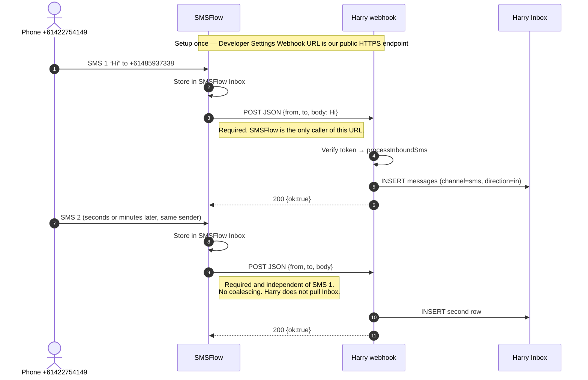
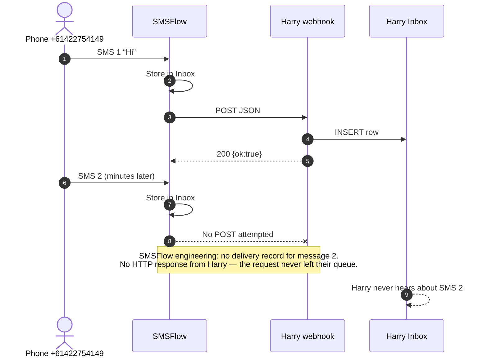

# Inbound SMS webhook — required sequence

Harry **receives** inbound SMS. SMSFlow must **POST once per received message**. Harry never posts this URL and never pulls SMSFlow Inbox.

Webhook: `POST https://harrythemarketer.com/api/hooks/smsflow/sms?token=…`  
Handler: `server/channels/webhook.js` (`smsflowRouter.post('/sms')`)

---

## What must happen (two texts, same sender)

SMSFlow confirmed (2 Sep 2026): no rate limiting, coalescing, or suppression for the same sender. Each inbound SMS is its own webhook delivery.

---

## What happened on 2 September (and 1 September)

SMSFlow does not retry failed deliveries. There is also nothing to retry when they never attempt the POST.

Harry does **not** make a second POST. The only POST we make is outbound send to `https://api.smsflow.com.au/v2/sms/send` (optional `callback_url` for delivery receipts of *our* texts). That path cannot recover a missed inbound.

---

## Who owns each hop

| Hop | Owner | Required? | If it fails |
|-----|--------|-----------|-------------|
| Phone → dedicated number | Carrier / SMSFlow | Yes | Nothing in either Inbox |
| Store in SMSFlow Inbox | SMSFlow | Yes (their log) | They would not see the text either |
| `POST /api/hooks/smsflow/sms` | SMSFlow queue | Yes — once per message | Harry never sees it. No poll. No retry. |
| Verify token + INSERT | Harry webhook | Yes, if POST arrives | SMSFlow would record 4xx/5xx. They recorded nothing. |
| HTTP 200 `{ok:true}` | Harry → SMSFlow | Yes, after insert | SMSFlow does not retry today |
| Second POST for SMS 2 | SMSFlow queue | Yes — independent of SMS 1 | Exactly the 2 Sep / 1 Sep miss |
| POST this webhook ourselves | Harry | **No** | Not a lever. We are the receiver. |
| Pull SMSFlow Inbox | Harry | **No — not built** | Missed texts stay in SMSFlow only |
