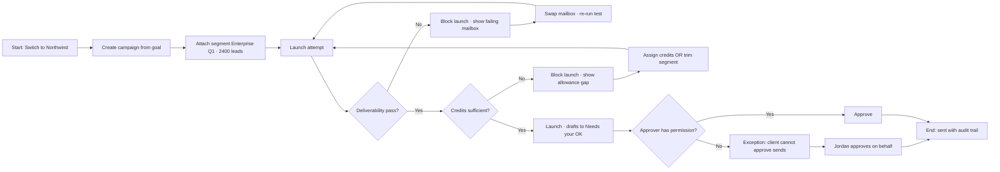

# Complex UX Brief — Stress Test

**Scenario:** Agency launches a client campaign while deliverability fails, credits run low, and permissions block the client from approving sends.

**Purpose:** Test brief → WYRE → HTML pipeline on branching, exceptions, and multi-actor handoffs — not a happy path.

**Owner:** Jordan Lee (agency)  
**Client actor:** Priya Basra (Northwind Brand, client-scoped user)  
**Version:** 1.0 · 2026-08-08

---

## Problem & goal

**Problem:** An agency must launch outreach for a client brand without leaking data across clients, sending from a unhealthy mailbox, or bypassing approval and credit rules.

**Goal:** Jordan gets Q1 Enterprise Outreach live for Northwind with 2,400 leads, a passing deliverability check, and every send waiting in Needs your OK — with a visible audit trail when rules block progress.

---

## Actors

| Actor | Wants |
|---|---|
| Jordan (agency owner) | Launch for Northwind without cross-client leaks; fix blockers fast |
| Priya (client user) | See only Campaigns + Leads; never see other brands |
| Harry (system) | Enforce credits, suppression, deliverability, approval — no silent bypass |

---

## Trigger

Jordan switches to **Northwind Brand** and opens **Campaigns → New campaign** linked to goal *Enterprise Q1*.

---

## Happy path (when nothing blocks)

1. Create campaign (name optional) → land in editor with starter playbook.
2. Readiness strip: playbook ✓ · mailbox ✓ · leads ✓.
3. Launch → drafts appear in **Inbox → Needs your OK**.
4. Jordan approves first batch → activity trail records actor + client scope.

---

## Main journey (realistic — with blockers)

---

## Screens required (7)

| # | Screen | Job |
|---|---|---|
| 1 | Client switcher + Campaigns list | Confirm Northwind scope before any action |
| 2 | Campaign editor + readiness strip | Show blockers as checklist items, not errors |
| 3 | Deliverability detail (failed test) | Explain *which* mailbox failed and *where* (inbox vs spam) |
| 4 | Launch blocked — credits modal | Show required vs available; offer trim or request allowance |
| 5 | Needs your OK (client scope) | Priya sees drafts but Approve is disabled with reason |
| 6 | Needs your OK (owner override) | Jordan sees same drafts with Approve enabled |
| 7 | Activity trail snippet | Prove who acted, for which client, without note bodies |

---

## Exceptions & support paths (must be visible)

| Exception | User sees | System does |
|---|---|---|
| Deliverability fail | Red mailbox on readiness strip + link to test detail | Launch disabled until pass or mailbox swap |
| Insufficient credits | Modal: need 2,400 sends, client has 800 left | Launch disabled; no partial silent launch |
| Client cannot approve | Approve greyed: "Only workspace owners can approve sends" | Draft stays queued |
| Lead on block list | Toast after attach: "3 leads skipped — on block list" | Segment attaches 2,397; skipped names listed |
| Double launch click | Idempotent — one campaign, no duplicate drafts | Second click shows existing queue |

---

## Handoffs

| From | To | Trigger |
|---|---|---|
| Jordan | Harry | Launch clicked |
| Harry | Jordan | Deliverability or credit block |
| Jordan | Priya | Drafts queued (notification optional — out of scope) |
| Priya | Jordan | Approve denied → owner must act |

---

## Decisions

| Decision | Options | Outcome |
|---|---|---|
| Deliverability failed | Swap mailbox · Wait for test · Cancel | Swap → re-test; Wait → strip stays blocked |
| Credits insufficient | Request allowance · Trim segment · Cancel | Trim recalculates send count live |
| Who approves? | Owner · Wait | Client never gets a workaround URL |

---

## Policy terminals (not happy endings)

- **STOP:** Client user cannot be granted approve permission — product rule, not a bug.
- **STOP:** Suppression is unconditional — no "ignore block list" on attach.
- **STOP:** Nothing sends without explicit OK — including owner override (owner still clicks Approve).

---

## Hard rules (product)

1. Client scope implied by switcher — never a per-page filter.
2. One `!primary` per screen; destructive actions confirmed.
3. Readiness strip links to the fix, not generic help.
4. Credit and deliverability blocks use the same modal shell (consistent muscle memory).

---

## Success metrics

| Who | Measures success by |
|---|---|
| Jordan | Campaign live, blockers resolved in one session, trail complete |
| Priya | Sees only Northwind data; understands why she can't approve |
| Business | Zero cross-client rows; zero sends without OK |

---

## Out of scope (intentional)

- Email composer as free-form send
- Client self-serve credit purchase
- Auto-approve rules
- Notification preferences

---

## Test acceptance (for prototype review)

- [ ] Can trace Northwind scope on every screen without a filter control
- [ ] Launch blocked states are distinct from loading states
- [ ] Client and owner Needs your OK are two variants of one screen, not two products
- [ ] Deliverability failure names the mailbox and the metric that failed
- [ ] Activity trail omits note bodies and passwords

---

## Source

Synthetic stress test — not from endpoint specs. Designed to break naive "one dashboard" wireframes.
