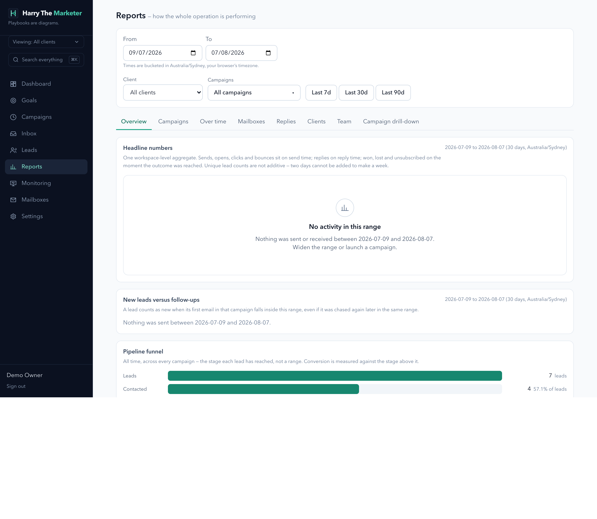

# analytics — visual verification

22 endpoint specs. Regenerate with `npm run gallery`.

> A capture proves the surface renders with real data. Whether each spec's
> acceptance criteria are met is the **Verdict** column, from
> [../../REQUIREMENTS-MATRIX.md](../../REQUIREMENTS-MATRIX.md).

## Captures

### Reports — 28 analytics endpoints across eight tabs

Every rate now reads server/metrics.js, so this and the campaign header cannot disagree.

**desktop**

## What the specs in this category are judged at

| Spec | Verdict | Notes |
|---|---|---|
| [Get Campaign List](../campaign-list.md) | Not reviewed |  |
| [Campaign Response Stats](../campaign-response-stats.md) | Not reviewed |  |
| [Campaign Status Stats](../campaign-status-stats.md) | Not reviewed |  |
| [Get Client List](../client-list.md) | Not reviewed |  |
| [Day-wise Positive Reply Stats](../day-wise-positive-reply.md) | Not reviewed |  |
| [Positive Reply Stats by Sent Time](../day-wise-positive-sent-time.md) | Not reviewed |  |
| [Day-wise Stats by Sent Time](../day-wise-sent-time.md) | Not reviewed |  |
| [Domain-wise Health Metrics](../domain-wise-health.md) | Not reviewed |  |
| [Email-ID-wise Health Metrics](../email-wise-health.md) | Not reviewed |  |
| [Lead Category-wise Response](../lead-category-response.md) | Not reviewed |  |
| [Lead Statistics](../lead-stats.md) | Not reviewed |  |
| [Leads Take for First Reply](../leads-for-first-reply.md) | Not reviewed |  |
| [Get Month-wise Client Count](../month-wise-client-count.md) | Not reviewed |  |
| [Provider-wise Performance](../provider-performance.md) | Not reviewed |  |
| [Campaign Performance](../campaign-performance.md) | Partial | 5/8 criteria; 1/4 DoD. |
| [Client Overall Stats](../client-performance.md) | Fixed — reverify | client_health corrected to positive_replied/unique_lead_count (was the non-bounce share); old figure kept as non_bounce_rate. UI copy corrected to match. |
| [Get Day-wise Overall Stats](../day-wise-stats.md) | Partial | 4/7 criteria. |
| [Follow-up Reply Rate](../followup-reply-rate.md) | Partial | 5/7 criteria; 1/11 TC covered. |
| [Lead to Reply Time](../lead-to-reply-time.md) | Near-complete | Only spec audited with all §5 DoD met (4/4); 5/7 criteria. |
| [Mailbox Overall Stats](../mailbox-health.md) | Partial | unsubscribed/won/lost are structurally 0 on every mailbox-keyed surface — outcome rows are grouped by mailbox_id, which the query does not select. Also `remaining_today` is a ramp-blind copy of pacing.remainingToday. |
| [Get Overall Analytics](../overview.md) | Partial | 5/8 criteria; 1/4 DoD. |
| [Team Board Stats](../team-board-stats.md) | Partial | Backend fields added. **§4 placement still wrong** — DoD says it must NOT be on Reports; it is a Reports tab. Needs a frontend move to Settings → Team. |
