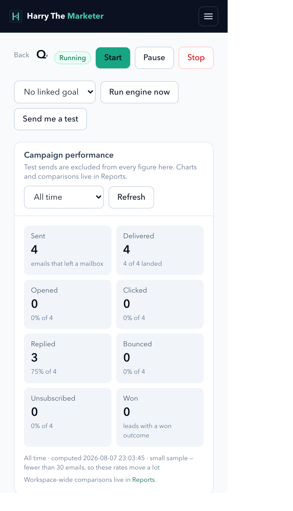
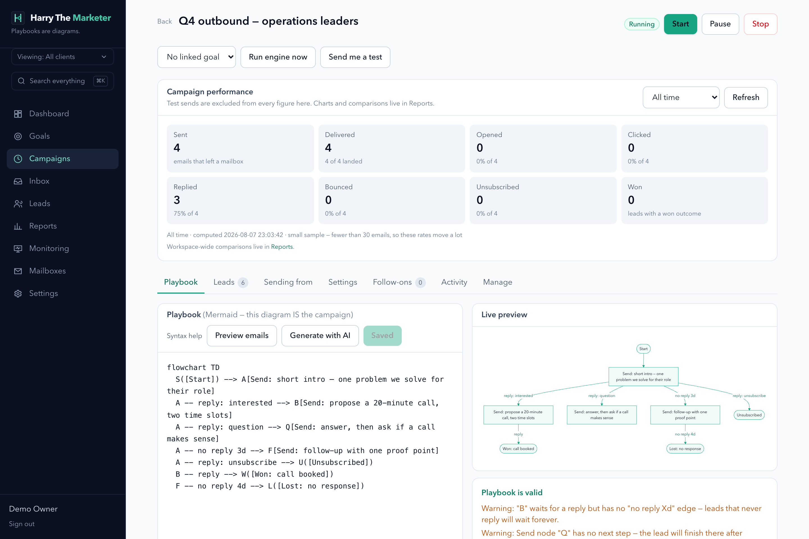

# campaign-statistics — visual verification

6 endpoint specs. Regenerate with `npm run gallery`.

> A capture proves the surface renders with real data. Whether each spec's
> acceptance criteria are met is the **Verdict** column, from
> [../../REQUIREMENTS-MATRIX.md](../../REQUIREMENTS-MATRIX.md).

## Captures

### Campaign — the playbook IS the campaign

Mermaid editor with live render, launch checklist, and START/PAUSE/STOP — never ACTIVE.

**mobile**

**desktop**

### Reports — 28 analytics endpoints across eight tabs

Every rate now reads server/metrics.js, so this and the campaign header cannot disagree.

**desktop**

## What the specs in this category are judged at

| Spec | Verdict | Notes |
|---|---|---|
| [Fetch Campaign Statistics by Date Range](../get-by-date-range.md) | Partial | 4/7 criteria. |
| [Fetch Campaign Statistics by Campaign ID](../get-by-id.md) | Partial | campaign_id, unsubscribed, bounds and clamping added. 'write an events row' refused: analytics writes no events by design. |
| [Fetch Campaign Lead Statistics](../lead-statistics.md) | Partial | 4/7 criteria. |
| [Fetch Campaign Mailbox Statistics](../mailbox-statistics.md) | Partial | 5/7 criteria. |
| [Fetch Campaign Top Level Analytics by Date Range](../top-level-by-date.md) | Partial | 3/7 criteria. |
| [Fetch Campaign Top Level Analytics](../top-level.md) | Partial | 3/7 criteria. |
