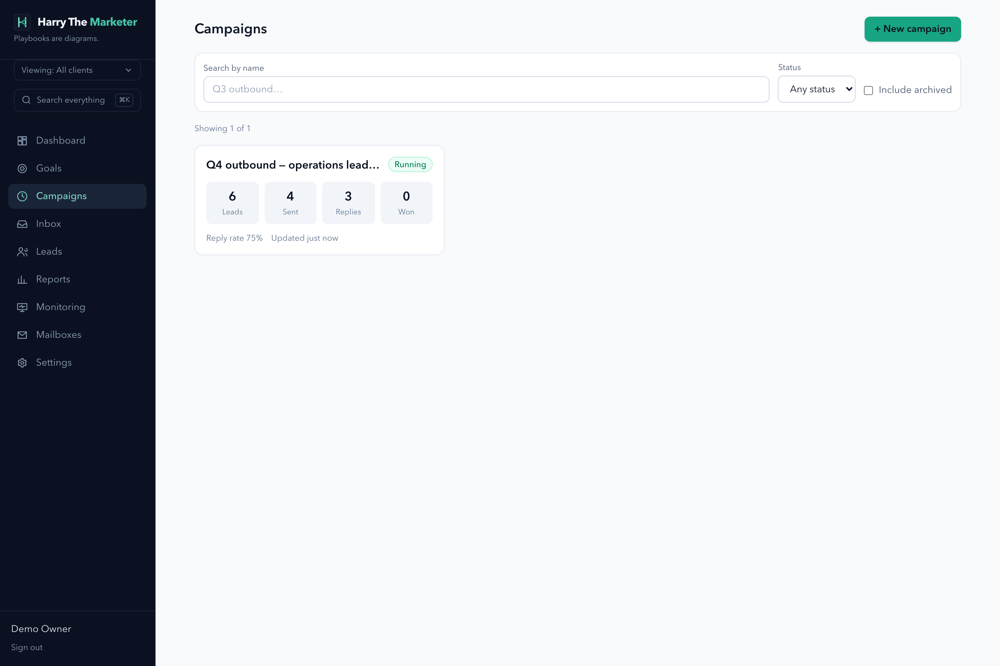

# campaigns — visual verification

42 endpoint specs. Regenerate with `npm run gallery`.

> A capture proves the surface renders with real data. Whether each spec's
> acceptance criteria are met is the **Verdict** column, from
> [../../REQUIREMENTS-MATRIX.md](../../REQUIREMENTS-MATRIX.md).

## Captures

### Campaigns — server-paged and filtered

The unbounded fetch is gone; filters and paging are server-side.

**desktop**

### Campaign — the playbook IS the campaign

Mermaid editor with live render, launch checklist, and START/PAUSE/STOP — never ACTIVE.

**mobile**

**desktop**

### Command palette (⌘K) — searching across every kind of record

One search over leads, campaigns, segments, clients, labels, mailboxes and placement tests.

**1 closed**

**2 open**

**3 searching**

## What the specs in this category are judged at

| Spec | Verdict | Notes |
|---|---|---|
| [Create Subsequence Campaign](../create-subsequence.md) | FAILS | 3/8 criteria; 1/4 DoD. |
| [Reply to Campaign Lead](../reply-email-thread.md) | FAILS | 4/8 criteria. cc/bcc validated and echoed but not passed to sendEmail; no attachment or signature handling. |
| [Update Lead Category in Campaign](../update-lead-category.md) | FAILS | A human intent correction is reversed by the next tick — the route reports routedTo but never sets node_id, and leaves messages.intent empty so the engine reclassifies. The existing test is titled 'survives as human-set' and never ticks. |
| [Update Lead Email Account](../update-lead-email-account.md) | FAILS | Per-lead mailbox pins and the whole campaign_mailboxes pool have no reader in engine/mailer/gates/pacing — engine.js uses campaign.mailbox_id. Proven: pinned to mailbox 2, sent from mailbox 1. |
| [Add Email Accounts to Campaign](../add-email-accounts.md) | Not reviewed |  |
| [Get All Leads Activities](../all-leads-activities.md) | Not reviewed |  |
| [Create Campaign](../create.md) | Not reviewed |  |
| [Delete Lead from Campaign](../delete-lead.md) | Not reviewed |  |
| [Delete Campaign Webhook](../delete-webhook.md) | Not reviewed |  |
| [Delete Campaign](../delete.md) | Not reviewed |  |
| [Get Campaign Analytics by Date Range](../get-analytics-by-date.md) | Not reviewed |  |
| [Get Campaign by ID](../get-by-id.md) | Not reviewed |  |
| [Get Campaign Email Accounts](../get-email-accounts.md) | Not reviewed |  |
| [Get Lead by ID](../get-lead-by-id.md) | Not reviewed |  |
| [Get Lead Message History](../get-lead-history.md) | Not reviewed |  |
| [Get Top Level Analytics by Date](../get-top-level-analytics.md) | Not reviewed |  |
| [Get Webhook Summary](../get-webhook-summary.md) | Not reviewed |  |
| [Get Campaign Webhooks](../get-webhooks.md) | Not reviewed |  |
| [Mark Lead as Complete](../mark-lead-complete.md) | Not reviewed |  |
| [Remove Email Accounts from Campaign](../remove-email-accounts.md) | Not reviewed |  |
| [Create/Update Campaign Webhook](../save-webhooks.md) | Not reviewed |  |
| [Unsubscribe Lead from Campaign](../unsubscribe-lead.md) | Not reviewed |  |
| [Update Campaign Lead Details](../update-lead.md) | Not reviewed |  |
| [Update Campaign Schedule](../update-schedule.md) | Not reviewed |  |
| [Update Campaign Team Member](../update-team-member.md) | Not reviewed |  |
| [Add Leads to Campaign](../add-leads.md) | Partial | Field aliases, snake_case counts, telemetry added. 'Duplicate counts as skipped' deliberately reported as reusedExistingCount instead. |
| [Duplicate Campaign](../duplicate.md) | Complete (backend) | Only spec audited with all §2 criteria met. Frontend weaker. |
| [Export Campaign Leads](../export-leads.md) | Partial | 6/8 criteria. |
| [Forward Campaign Email](../forward-email.md) | Fixed — verified | The forward wrote send_status 'forwarded' while REAL_SEND excluded 'forward', so every forward inflated `sent` and halved the open/click denominators. One vocabulary now, plus a test that fails on any unclassified send_status literal. |
| [Get All Campaigns](../get-all.md) | Partial | 5/9 criteria. |
| [Get Campaign Analytics](../get-analytics.md) | Fixed — verified | Both siblings now read server/metrics.js. /top-level-analytics was recomputing open and reply rates with swapped denominators — 33.3%/50% vs 50%/33.3% on the same campaign at the same instant. |
| [Get Bulk Lead Message History](../get-leads-history-bulk.md) | Near-complete | 7/8 criteria. Null/absent/empty id lists refused. |
| [Get Campaign Leads](../get-leads.md) | Fixed — reverify | One SQL statement with COUNT(*) OVER(); export streams via .iterate(). Was ~50,001 queries for page one. |
| [Get Campaign Sequences](../get-sequences.md) | Partial | 4/8 criteria. |
| [Pause Campaign Lead](../pause-lead.md) | Fixed — verified | **Pausing did not stop the engine** — engine.js selected on `state` alone and never read `paused_at`, so a paused lead kept receiving follow-ups. Now skipped, with `resume_at` letting a pause expire on its own. tests/engine-pause.test.js. |
| [Resume Campaign Lead](../resume-lead.md) | Fixed — verified | Clearing paused_at/resume_at returns the lead to the engine's selection. Covered by tests/engine-pause.test.js. |
| [Retrigger Campaign Webhooks](../retrigger-webhooks.md) | Complete (backend) | 8/8 criteria, 4/4 DoD — the only spec audited so far that meets everything. |
| [Send Test Email](../send-test-email.md) | Fixed — verified | Test sends and forwards excluded at source via REAL_SEND in server/metrics.js. |
| [Get Campaign Statistics](../statistics.md) | Fixed — reverify | Documented parameter names, row fields and rollup implemented; email_status now filters on what happened, not send_status. |
| [Update Campaign Sequences](../update-sequences.md) | Partial | preview mode, delay ceiling, remapping report, telemetry added. Thread-continuation criteria live in mailer/engine. |
| [Update Campaign Settings](../update-settings.md) | Fixed — verified | track_opens/track_clicks now reach the wire — buildHtmlBody takes flags and mailer passes the campaign's real values. Unsubscribe link deliberately not optional. |
| [Update Campaign Status](../update-status.md) | Fixed — verified | STOPPED now terminal on BOTH routes; the legacy PUT /campaigns/:id 409s. Proven by a test driving the real router through a real session. |
