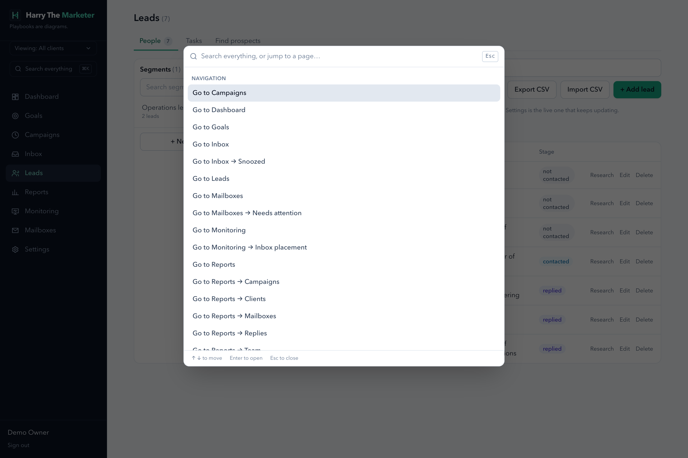
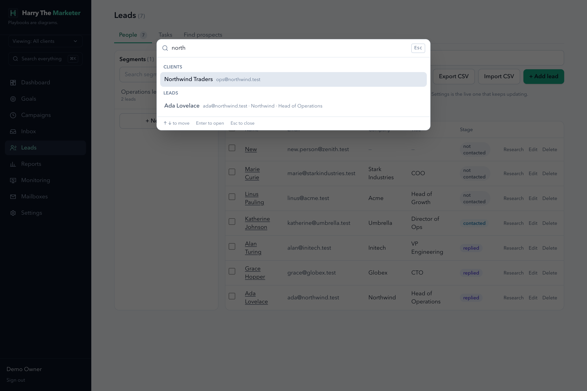
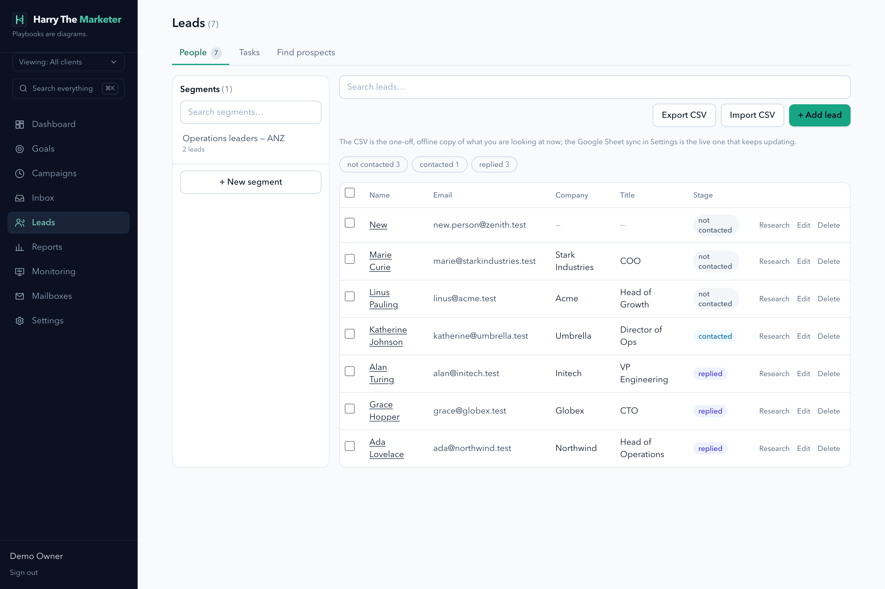
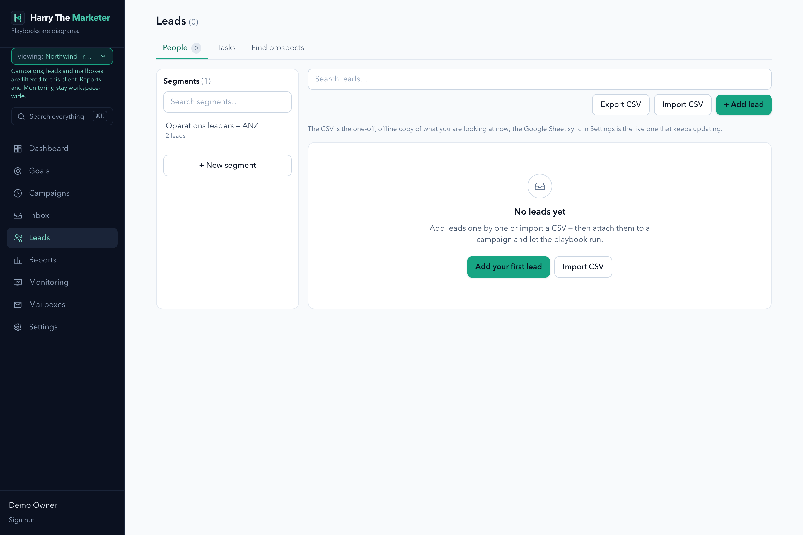

# clients — visual verification

4 endpoint specs. Regenerate with `npm run gallery`.

> A capture proves the surface renders with real data. Whether each spec's
> acceptance criteria are met is the **Verdict** column, from
> [../../REQUIREMENTS-MATRIX.md](../../REQUIREMENTS-MATRIX.md).

## Captures

### Settings — clients, webhooks, suppression, providers

Never-contact list, webhook registry with its delivery log, agency clients, and the honest provider status.

**mobile**

**desktop**

### Command palette (⌘K) — searching across every kind of record

One search over leads, campaigns, segments, clients, labels, mailboxes and placement tests.

**1 closed**

**2 open**

**3 searching**

### Client lens — scoping the product to one client

client_id is a real partition. Selecting a client filters campaigns, leads and mailboxes, and says so continuously.

**1 all clients**

**2 scoped**

## What the specs in this category are judged at

| Spec | Verdict | Notes |
|---|---|---|
| [Get All Clients](../get-all.md) | Not reviewed |  |
| [Update Client](../update.md) | Not reviewed |  |
| [Manage Client API Keys](../api-keys.md) | Known gap — documented | Keys mint/hash/revoke correctly but authenticate nothing — resolveClientApiKey has no production caller. Declared in README. |
| [Create Client](../create.md) | Known gap — documented | password rejection verified. Permissions and allowances are recorded but enforced nowhere. Declared in README. |
