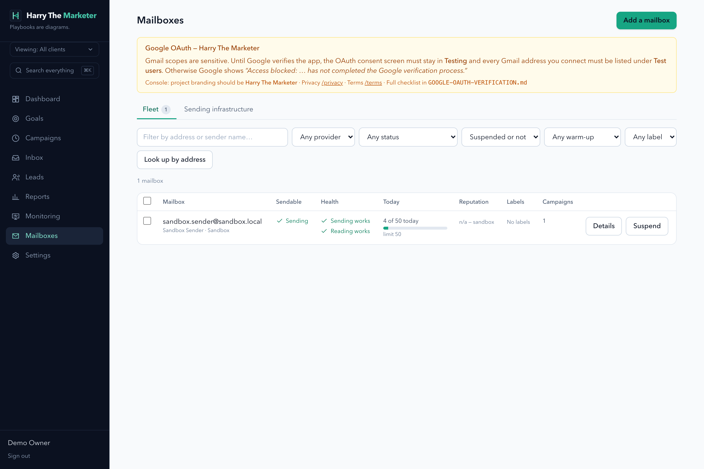

# email-accounts — visual verification

11 endpoint specs. Regenerate with `npm run gallery`.

> A capture proves the surface renders with real data. Whether each spec's
> acceptance criteria are met is the **Verdict** column, from
> [../../REQUIREMENTS-MATRIX.md](../../REQUIREMENTS-MATRIX.md).

## Captures

### Mailboxes — fleet, warm-up and sending infrastructure

Sendability with its reason, usage against the effective cap, and the senders procurement flow.

**desktop**

## What the specs in this category are judged at

| Spec | Verdict | Notes |
|---|---|---|
| [Add OAuth Email Account](../add-oauth.md) | Not reviewed |  |
| [Delete Email Account](../delete.md) | Not reviewed |  |
| [Get All Email Accounts](../get-all.md) | Not reviewed |  |
| [Get Email Account by ID](../get-by-id.md) | Not reviewed |  |
| [Suspend Email Account](../suspend.md) | Not reviewed |  |
| [Get All Tags](../tags.md) | Not reviewed |  |
| [Unsuspend Email Account](../unsuspend.md) | Not reviewed |  |
| [Update Email Account](../update.md) | Not reviewed |  |
| [Update Warmup Settings](../warmup-settings.md) | Not reviewed |  |
| [Add SMTP Email Account](../add-smtp.md) | Known gap — documented | Validated 501 stub; credentials discarded, never stored. Now declared in README under 'Known gaps' rather than left as an undocumented surprise. |
| [Get Warmup Statistics](../warmup-stats.md) | Fixed — verified | warmup_stats now has a production writer (upkeep rollup, upserted, workspace timezone). `guidance.healthy` is null with `verdict: 'not_enough_data'` when there is no evidence, instead of asserting `true` from zero rows. |
