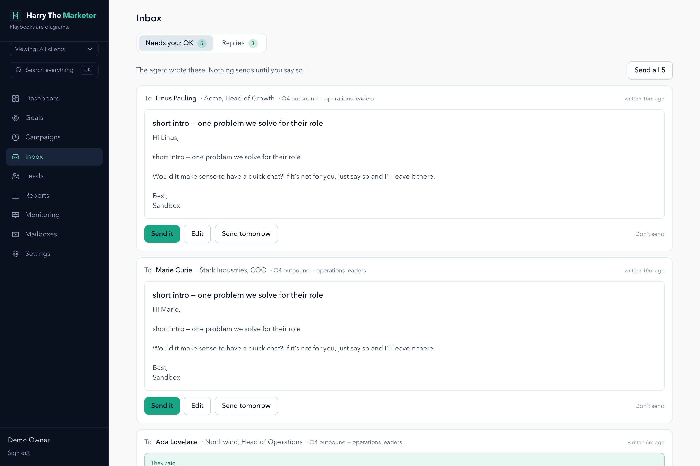

# inbox — visual verification

25 endpoint specs. Regenerate with `npm run gallery`.

> A capture proves the surface renders with real data. Whether each spec's
> acceptance criteria are met is the **Verdict** column, from
> [../../REQUIREMENTS-MATRIX.md](../../REQUIREMENTS-MATRIX.md).

## Captures

### Inbox — ten states, one list

SmartLead ships ten near-identical inbox screens; this is one list with a state selector. "Needs your OK" stays first.

**desktop**

## What the specs in this category are judged at

| Spec | Verdict | Notes |
|---|---|---|
| [Get Important Emails](../get-important.md) | FAILS | importance_score / importance_reasons exist nowhere in the codebase; 3 of 4 DoD items unimplementable as specified. |
| [Create Lead Note](../create-note.md) | Not reviewed |  |
| [Get Archived Emails](../get-archived.md) | Not reviewed |  |
| [Get Assigned to Me](../get-assigned.md) | Not reviewed |  |
| [Get Inbox Item by ID](../get-by-id.md) | Not reviewed |  |
| [Get Reminder Emails](../get-reminders.md) | Not reviewed |  |
| [Get Scheduled Emails](../get-scheduled.md) | Not reviewed |  |
| [Get Sent Emails](../get-sent.md) | Not reviewed |  |
| [Get Snoozed Emails](../get-snoozed.md) | Not reviewed |  |
| [Get Unread Replies](../get-unread.md) | Not reviewed |  |
| [Get Untracked Replies](../get-untracked.md) | Not reviewed |  |
| [Get Custom View Emails](../get-views.md) | Not reviewed |  |
| [Push Lead to Subsequence](../push-to-subsequence.md) | Not reviewed |  |
| [Get Reply Status](../reply-status.md) | Not reviewed |  |
| [Resume Paused Lead](../resume-lead.md) | Not reviewed |  |
| [Set Lead Reminder](../set-reminder.md) | Not reviewed |  |
| [Update Lead Category](../update-category.md) | Not reviewed |  |
| [Update Lead Revenue](../update-revenue.md) | Not reviewed |  |
| [Assign Team Member](../update-team-member.md) | Not reviewed |  |
| [Block Email Domains](../block-domains.md) | Fixed — verified | Both block routes now call applySuppression() — enrolments stopped, drafts declined, queued sends cancelled, identically. Draft approval and approve-all also refuse suppressed recipients. |
| [Create Lead Task](../create-task.md) | Divergent | Spec names `DELETE /api/tasks/:id`; implemented as `PATCH` to `status:'cancelled'` so the trail survives. **Unreviewed: is a hard delete actually wanted?** |
| [Forward Email](../forward.md) | Fixed — verified | Suppression enforced in gmailSend, the real transport chokepoint; BCC recipients now actually sent. Covered by tests/suppression-chokepoint.test.js. |
| [Get Inbox Replies](../get-messages.md) | Fixed — verified | Reply-time filters compared SQLite's 'YYYY-MM-DD HH:MM:SS' against an ISO string; now datetime()-normalised on both sides. |
| [Change Read Status](../mark-read.md) | Partial | Bulk is all-or-nothing and every result row is hardcoded ok:true; the spec's TC-9 documents partial success and the existing test asserts the opposite. |
| [Reply to Email](../reply.md) | Partial | The HTTP 500 on a bounced lead is fixed — one suppressionFor() check covers block list, unsubscribe and bounce, refused as a 422. Still missing: CC/BCC, attachments, signature toggle. |
