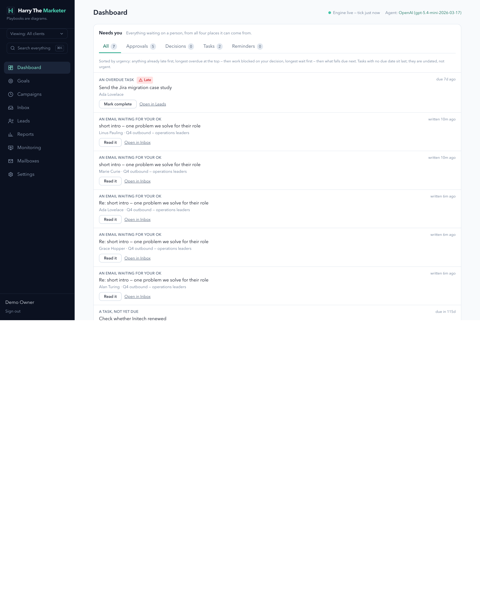
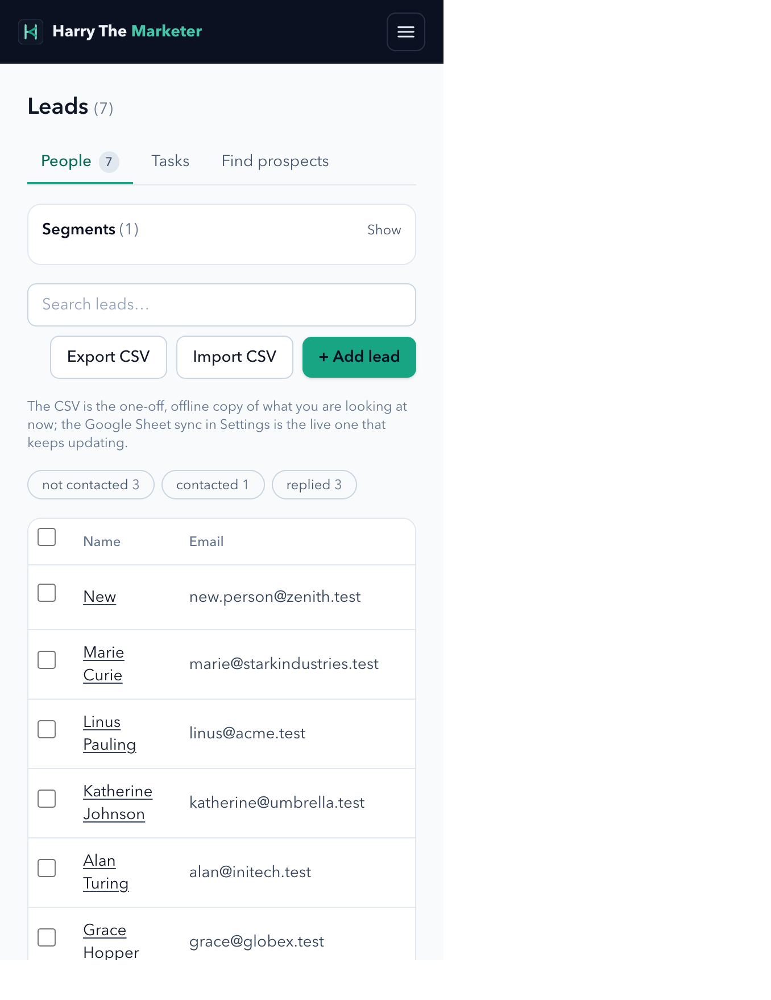

# lead-notes — visual verification

2 endpoint specs. Regenerate with `npm run gallery`.

> A capture proves the surface renders with real data. Whether each spec's
> acceptance criteria are met is the **Verdict** column, from
> [../../REQUIREMENTS-MATRIX.md](../../REQUIREMENTS-MATRIX.md).

## Captures

### Dashboard — the one "Needs you" queue

Approvals, parked decisions, open tasks and due reminders in one list, ordered by urgency.

**desktop**

### Leads — labels, segments, tasks, prospect search

Segments sidebar, derived stage strip, labels, and the Find-prospects pane.

**mobile**

**desktop**

## What the specs in this category are judged at

| Spec | Verdict | Notes |
|---|---|---|
| [Create Lead Note](../create.md) | Not reviewed |  |
| [Get Lead Notes](../get-all.md) | Not reviewed |  |
