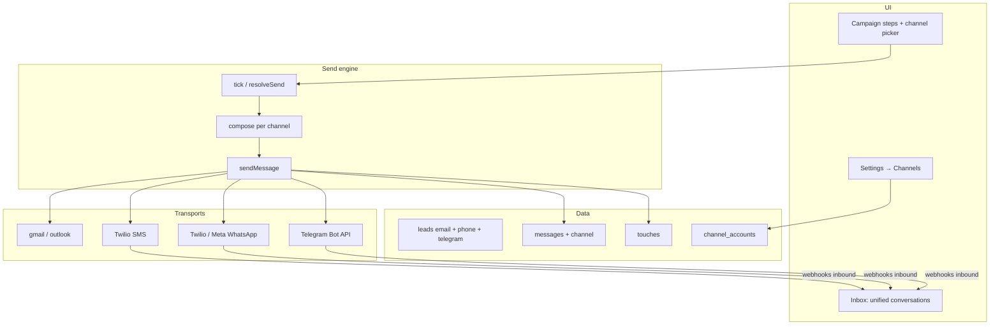

# Plan: SMS, WhatsApp & Telegram (alongside Gmail / Outlook)

## Goal

Extend Harry from **email-only outreach** to **multi-channel sequences**: email (Gmail/Outlook), SMS, WhatsApp, and Telegram — one engine, one inbox mental model, one set of send gates.

Keep email OAuth as-is. Add messaging via a **CPaaS / Business API** layer so Harry never runs its own SMS gateway or hosts phone numbers.

---

## Current state (what we already have)

| Piece | Today | Useful for messaging |
|-------|--------|----------------------|
| Providers | `gmail`, `outlook`, `sandbox` in `mailboxes` | Need a parallel “channel account” model |
| Transport | `mailer.sendEmail` | Needs `sendMessage({ channel, … })` |
| Touch ledger | `touches.channel` already exists | Frequency caps already multi-channel aware |
| Gates | `resolveSend(…, channel='email')` + one-channel-per-day | Reuse; add channel-specific quiet hours |
| Leads | `leads.phone` exists | SMS / WhatsApp address |
| Playbook | Mermaid `Send:` nodes = email | Need `Send SMS:`, `Send WhatsApp:`, `Send Telegram:` (or typed Send) |
| Inbox | Email threads | Need conversation threads per channel |

---

## Product model

### Channels

| Channel | Address on lead | “From” account | Notes |
|---------|-----------------|----------------|-------|
| **email** | `email` | Connected Gmail / Outlook mailbox | Existing |
| **sms** | `phone` (E.164) | Workspace SMS sender (Twilio-class number) | Opt-in required in most regions |
| **whatsapp** | `phone` (E.164) | WhatsApp Business number | Template messages until user replies (Meta rules) |
| **telegram** | `telegram_user_id` / username | Bot token | User must start bot / share contact first |

### Account types (do not overload `mailboxes`)

Introduce **`channel_accounts`** (or `senders`) distinct from email mailboxes:

```
channel_accounts
  id, workspace_id
  channel          -- sms | whatsapp | telegram
  provider         -- twilio | messagebird | vonage | meta_cloud | telegram_bot
  display_name
  external_id      -- phone SID / WABA id / bot id
  credentials_enc  -- API keys / tokens (never logged)
  status           -- connected | error | suspended
  daily_limit, sent_today, …
```

Email stays on `mailboxes`. Campaigns attach **zero or more** channel accounts the same way they attach mailboxes today.

### Playbook

Keep Mermaid; extend Send steps with an explicit channel:

```
A[Send email: Intro and ask for 15 minutes]
B[Wait: 2d]
C[Send sms: Short nudge with booking link]
D[Send whatsapp: Template follow-up]
```

Engine node type stays `send`, with `channel` parsed from the label (default `email` for backward compatibility).

---

## Third-party services (recommended stack)

Pick **one primary CPaaS** for SMS (+ optional WhatsApp), plus native APIs where required:

| Channel | Recommended approach | Alternatives |
|---------|----------------------|--------------|
| **SMS** | **Twilio** Messaging API (AU-friendly, mature webhooks) | MessageBird, Vonage, Plivo |
| **WhatsApp** | **Twilio WhatsApp** *or* **Meta Cloud API** directly | MessageBird, 360dialog |
| **Telegram** | **Telegram Bot API** (official, free) | None needed |
| **Email** | Keep **Gmail + Outlook OAuth** (no ESP required) | — |

**Default recommendation for Harry v1**

1. **Twilio** — SMS + WhatsApp (one vendor, one webhook model, one billing surface)
2. **Telegram Bot API** — direct (no middleman)
3. **Gmail / Outlook** — unchanged

Later: abstract behind `server/channels/*.js` so Twilio can be swapped without rewriting the engine.

---

## Architecture



### Core API shape

```js
// server/channels/send.js
sendMessage({
  channel,          // email | sms | whatsapp | telegram
  account,          // mailbox OR channel_account
  user, campaign, lead, nodeId,
  body,             // text; WhatsApp may need templateName + vars
  subject,          // email only
})
```

Email path calls today’s `sendEmail`. Others call provider adapters. All paths:

1. Suppression / opt-in check  
2. `resolveSend(…, channel)`  
3. Provider send  
4. Insert `messages` row with `channel`  
5. `recordTouch({ channel })`

---

## Consent & compliance (non-negotiable)

Messaging is stricter than email. Ship these before any real send:

| Rule | SMS | WhatsApp | Telegram |
|------|-----|----------|----------|
| Explicit opt-in stored on lead | Required | Required (Business) | User must /start bot |
| STOP / unsubscribe | Keyword handling + suppression | Opt-out per Meta rules | Bot block / command |
| Quiet hours | Stricter default (e.g. 08:00–20:00 local) | Same | Same |
| Templates | Free-form OK (with consent) | **Approved templates** outside 24h session | Free-form after start |
| One channel per day | Already in gates | Honour | Honour |
| Never contact | Extend suppression to phone / telegram id | Same | Same |

Store on lead (or `consent` table):

- `sms_opt_in_at`, `sms_opt_in_source`
- `whatsapp_opt_in_at`
- `telegram_chat_id`, `telegram_started_at`

No send without the relevant opt-in (engine refusal, same spirit as email suppression).

---

## Inbox & replies

- Webhooks → normalize → `messages` with `channel`, `direction`, `thread_id`
- Thread key: per lead + channel + account (not Gmail thread id)
- Intent classifier: reuse for inbound text; WhatsApp/Telegram often shorter — tune prompts
- Manual reply from Inbox: channel-aware composer (SMS length counter, WA template vs session message)

---

## Settings UX

**Settings → Channels**

- Connect Twilio (Account SID + Auth Token + messaging service / from number)
- Connect WhatsApp sender (via Twilio or Meta)
- Connect Telegram bot (bot token from @BotFather)
- Per-channel daily caps, quiet hours override
- Test send to your own phone / chat

**Campaign → Steps**

- Each Send step shows channel badge
- Validation: lead must have phone / telegram id before enqueue
- Preview: “Why isn’t this SMS sending?” via existing send-status / gates

**Mailboxes page** stays email. New **Channels** section for SMS/WA/Telegram accounts.

---

## Phased delivery

### Phase 0 — Foundations (no real traffic)
- Schema: `channel_accounts`, `messages.channel`, lead consent + `telegram_chat_id`
- `sendMessage` façade; email delegates to `sendEmail`
- Gates: channel passed everywhere; SMS quiet-hour defaults
- Sandbox channel accounts for local E2E (like email sandbox)

### Phase 1 — SMS (Twilio)
- Connect sender, test send, campaign `Send sms:` step
- Inbound webhook + STOP handling → suppression
- Approval queue works for SMS drafts (same as email)
- Caps + touch ledger

### Phase 2 — WhatsApp
- Template registry in Harry (name, language, variables)
- Send template outside session; free-form inside 24h window
- Inbound webhook; session clock on lead/thread
- Clear UI when a step needs a template vs free text

### Phase 3 — Telegram
- Bot connect; deep link / start payload to bind lead
- Send + inbound updates
- No templates; consent = user started bot

### Phase 4 — Sequencing polish
- Multi-channel playbook templates in AI playbook generator
- Reports split by channel
- Deliverability-style health for SMS (bounce / undelivered) and WA quality rating

---

## Engine / data changes (checklist)

- [ ] `messages.channel` (`email` default for backfill)
- [ ] `channel_accounts` + campaign attachment table
- [ ] `leads.phone` normalized to E.164 on import
- [ ] Consent columns + suppression by phone / telegram
- [ ] Playbook parser: channel on send nodes
- [ ] `composeSms` / `composeWhatsApp` / `composeTelegram` (shorter, no subject)
- [ ] Webhook routes: `/api/hooks/twilio`, `/api/hooks/telegram` (signature verified)
- [ ] Inbox filters by channel
- [ ] Settings UI + campaign step UI
- [ ] Tests: gates, opt-in refusal, STOP, sandbox send, webhook idempotency

---

## Out of scope (v1)

- RCS / iMessage
- WhatsApp groups
- Telegram channels/groups (1:1 only)
- Buying/provisioning numbers inside Harry (link out to Twilio Console)
- Replacing Gmail/Outlook with an ESP

---

## Success criteria

1. A playbook can email, then SMS, then WhatsApp without double-texting the same day (gates).  
2. STOP on SMS permanently suppresses that phone.  
3. WhatsApp never sends free-form outside the session without a template.  
4. Telegram only messages users who started the bot.  
5. Sandbox path covers all three channels in CI without Twilio/Meta credentials.

---

## Open decisions (resolve before Phase 1 build)

1. **Twilio-only vs Meta-direct for WhatsApp** — recommend Twilio-first for one webhook/billing surface.  
2. **Shared vs per-client Twilio subaccounts** — agency/multi-client may need subaccounts later.  
3. **Approval default for SMS/WA** — recommend `require_approval` applies to all channels (safer).  
4. **AU sender ID / long-code / messaging service** — confirm Twilio AU product for production numbers.
