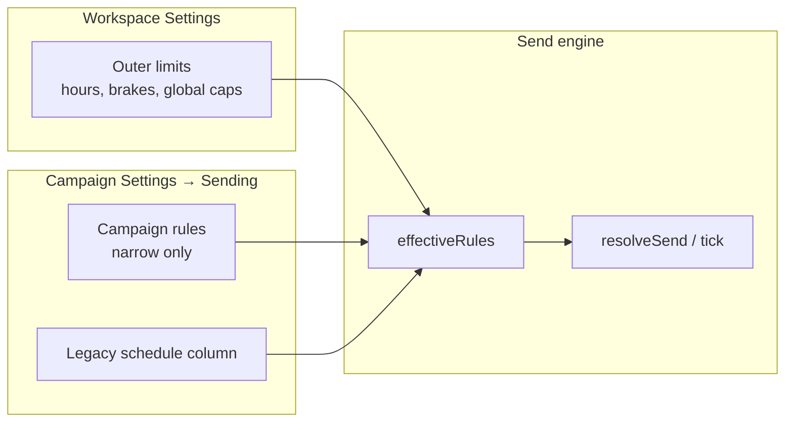

# Plan: Send controls per campaign (not global)

## Current state

You already have a **scoped send-rules engine** on the backend. The gap is mostly UI and a few settings that are still workspace-only.

| Layer | What exists today | Scope |
|-------|-------------------|--------|
| **Settings → Sending** | Approval toggle, paced toggle, legacy hours (`users.send_*`) | Workspace only |
| **Settings → Send controls** | Hours, quiet hours, blackouts, frequency, volume caps, brakes, holds, preview | Workspace only (`scope=workspace`) |
| **Campaign → Settings** | Behaviour + **Sending window** (`campaigns.schedule`) | Per campaign (partial) |
| **Backend `send_rules`** | Full rule document per `workspace` / `campaign` / `mailbox` | API supports all scopes; UI does not |

The backend merge order is already correct:

```js
// server/send-rules.js — effectiveRules()
let rules = workspaceRules(owner)
if (campaign) {
  rules = narrow(rules, legacyCampaignSchedule(campaign))
  rules = narrow(rules, storedRules(owner.id, 'campaign', campaign.id))
}
```

So the product model should be: **workspace = outer limits**, **campaign = how this plan sends within those limits**.

---

## Target model

### Workspace (Settings → Sending) — keep as ceiling

These should stay global because they protect the whole account:

- **Bounce brakes** — mailbox-level protection
- **Never contact / suppression** — already separate
- **Workspace-wide hold** (“pause everything”)
- **Default outer hours** — the ceiling campaigns cannot exceed
- **Frequency across plans** (“same person every N days across all campaigns”)
- **Workspace daily cap** — total sends across all plans
- **Paced vs blast** — reputation is shared across mailboxes

### Per campaign — move/configure here

Each campaign should own:

| Control | Why per campaign |
|---------|------------------|
| **Sending window** (days, hours, timezone, min gap) | Different plays need different timing |
| **Per-plan daily cap** (`campaignDaily`) | One aggressive launch vs one slow nurture |
| **Campaign blackouts** | e.g. “this launch pauses over Christmas” |
| **Recipient-local clock** | Some campaigns may want it, others not |
| **Require approval** | Some campaigns supervised, others autonomous |
| **Campaign hold** | Pause one plan without stopping the workspace |
| **Send status + preview** | “Why isn’t *this* campaign sending?” |
| **Send plan grid** (`SendScheduleGrid`) | Visual schedule for this campaign |

---

## Architecture



**Rule:** A campaign can only **narrow** workspace settings, never widen them. The UI must show three things (already in `rulesView`):

1. What the campaign set
2. What is actually in force after merge
3. What was inherited from workspace

---

## Phased implementation

### Phase 1 — Audit & decisions (½ day)

**Decisions to lock before coding:**

1. **`require_approval`** — add `campaigns.require_approval` (nullable: inherit workspace default) vs keep global only?
   - Recommendation: **per campaign**, nullable inherit. Matches “this launch needs OK, that one doesn’t.”

2. **`paced`** — workspace-only or per campaign?
   - Recommendation: **workspace-only** (mailbox reputation is shared).

3. **Frequency caps** — workspace-only or per campaign?
   - Recommendation: **workspace-only** (touches ledger is cross-campaign by design).

4. **Legacy `campaigns.schedule`** — migrate to `send_rules` scope=campaign, or keep both?
   - Recommendation: **migrate gradually** — write both during transition, read merged (already happens), then deprecate schedule column.

5. **Settings → Sending tab** — slim down to “defaults & safety” only; remove duplicate hour editors.

**Deliverable:** One-page scope doc signed off.

---

### Phase 2 — Campaign Sending UI (2–3 days)

**Goal:** Campaign Settings gets a proper **Sending** section, mirroring workspace send controls but scoped.

#### 2a. Extract shared components

Refactor `SendControlsSection.jsx` into reusable pieces:

```
web/src/send-controls/
  SendStatus.jsx          — scope prop: workspace | campaign
  HoursGroup.jsx          — shows inherited + effective
  VolumeGroup.jsx         — campaignDaily + minGap only at campaign scope
  CampaignSendControls.jsx — campaign entry point
  WorkspaceSendControls.jsx — workspace entry point (slimmed)
```

Campaign-scoped API calls:

```js
api.get(`/api/send-rules?scope=campaign&id=${campaignId}`)
api.put('/api/send-rules', { scope: 'campaign', id: campaignId, rules: patch })
api.get(`/api/send-status?campaignId=${campaignId}`)
api.get(`/api/send-preview?campaignId=${campaignId}&limit=8`)
api.post('/api/send-holds', { scope: 'campaign', id: campaignId, ... })
```

#### 2b. Replace / merge SchedulePanel

Today `SchedulePanel` writes `PUT /api/campaigns/:id/schedule` (single window). Options:

- **Option A (recommended):** Replace with campaign-scoped send-rules UI; keep schedule endpoint as a thin adapter that writes the same shape into `send_rules`.
- **Option B:** Keep SchedulePanel for simple cases, add “Advanced sending controls” below it.

Either way, **one source of truth** for the engine: `send_rules` + legacy adapter.

#### 2c. Wire SendScheduleGrid

`SendScheduleGrid.jsx` exists but is unused and calls a missing endpoint:

```js
api.get(`/api/send-schedule?campaignId=${campaignId}&limit=150`)
```

Add `GET /api/send-schedule` that returns:

- `windows`, `timezone`, `hours` (from `effectiveRules` for that campaign)
- `markers[]`: pending drafts, queued, projected (from send-preview logic), sent (from messages)
- `blocked`, `note`

Place it on the **Playbook tab** (as the file comment says) or under Campaign → Sending.

#### 2d. Campaign header status

Show per-campaign send status in the campaign header (same pattern as workspace “Right now”):

- “Holding — outside sending hours” with `until`
- Link to Campaign → Sending to fix

---

### Phase 3 — Backend completion (1–2 days)

Most API exists; fill gaps:

| Task | Notes |
|------|-------|
| **`require_approval` per campaign** | Add nullable column; `approvalRequired(owner, campaign)` checks campaign override first |
| **`GET /api/send-schedule`** | New endpoint for grid |
| **Schedule → send_rules sync** | On `PUT /campaigns/:id/schedule`, also write equivalent `send_rules` campaign row (or redirect UI to send-rules only) |
| **Campaign detail payload** | Include `sendStatus`, `sendRulesSummary` in `GET /campaigns/:id/detail` so header doesn’t need extra round-trip |
| **Duplicate campaign** | Copy campaign-scoped `send_rules` row when duplicating |

No schema change needed for send rules — `send_rules` table already supports campaign scope.

---

### Phase 4 — Slim workspace Settings (1 day)

Restructure Settings → Sending tab:

**Keep:**
- Workspace default hours (ceiling)
- Global hold / release
- Brakes + health
- Workspace-wide caps (`daily`, not `campaignDaily`)
- Link: “Each campaign can narrow these in its Sending settings”

**Remove / relocate:**
- Per-plan daily cap → campaign only
- Campaign-specific blackouts → campaign only
- Duplicate legacy hour fields in `SendingSection` once SendControls owns them

**Copy change:**

> “These are the outer limits for your workspace. Each campaign sets its own sending window within these — stricter, never looser.”

---

### Phase 5 — Migration (1 day)

For existing workspaces:

1. **No migration for empty campaign `send_rules`** — campaigns inherit workspace defaults (current behaviour).
2. **Campaigns with `schedule` set** — already merged via `legacyCampaignSchedule`; optionally backfill into `send_rules` on first read or one-off script:

```js
// For each campaign where schedule != '{}':
//   write send_rules(scope='campaign', rules=legacyCampaignSchedule(campaign))
```

3. **`require_approval`** — default `NULL` = inherit workspace; no behaviour change for existing users.

4. **Audit** — log `send_rules_changed` at campaign scope (already wired in `send-controls.js`).

---

### Phase 6 — Tests & verification (1–2 days)

Extend existing suites:

| Test file | Add |
|-----------|-----|
| `tests/send-controls.test.js` | Campaign hold, campaign status, campaign-scoped preview vs workspace hold |
| `tests/send-gates.test.js` | Campaign cap (`campaignDaily`) narrows workspace |
| `tests/campaigns-audit*.test.js` | UI/API: schedule save → effective rules change; campaign cannot widen workspace hours |
| New: `tests/campaign-send-controls.test.js` | require_approval per campaign; send-schedule endpoint markers |

**Manual checklist:**

- [ ] Two campaigns, different windows — only the matching one sends in its hours
- [ ] Campaign daily cap stops one plan, other plan continues
- [ ] Campaign hold pauses one plan; workspace hold pauses all
- [ ] Preview on campaign settings matches actual tick behaviour
- [ ] Send plan grid shows pending / scheduled / sent correctly

---

## UI placement (recommended)

**Campaign detail → Settings tab** (expand current layout):

```
Settings
├── Behaviour          (existing)
└── Sending            (new — replaces “Sending window”)
    ├── Right now      (status + campaign hold)
    ├── When it may send (hours, timezone, recipient-local)
    ├── How much       (per-plan daily cap, min gap)
    ├── Blackouts      (campaign-specific dates)
    └── Preview        (next N sends)
```

**Playbook tab** — add `SendScheduleGrid` at top or side panel for at-a-glance plan.

---

## Risks & mitigations

| Risk | Mitigation |
|------|------------|
| Three hour UIs confuse users | Consolidate to workspace ceiling + campaign window; deprecate legacy `SendingSection` hours |
| Campaign sets hours that don’t overlap workspace | Already warned on save (`view.warning`); show in campaign header |
| `require_approval` per campaign complicates inbox | Inbox already filters by campaign; badge “needs OK” stays campaign-scoped |
| SendScheduleGrid endpoint missing | Phase 2c — block grid on endpoint, not on UI component |

---

## Effort estimate

| Phase | Effort |
|-------|--------|
| 1. Decisions | 0.5 day |
| 2. Campaign UI + grid | 2–3 days |
| 3. Backend gaps | 1–2 days |
| 4. Slim workspace Settings | 1 day |
| 5. Migration | 1 day |
| 6. Tests | 1–2 days |
| **Total** | **~7–10 days** |

---

## Recommended first slice (MVP)

If you want the smallest useful increment:

1. **Campaign Sending panel** using existing `/api/send-rules?scope=campaign` — hours + per-plan cap + status + preview
2. **Replace SchedulePanel** with that panel (adapter keeps old API working)
3. **Campaign header** send-status line
4. **Defer** per-campaign `require_approval` and SendScheduleGrid to slice 2

That gets you “send controls are per campaign” for the controls users actually touch (timing and volume), without rewiring approval or building the grid endpoint first.
