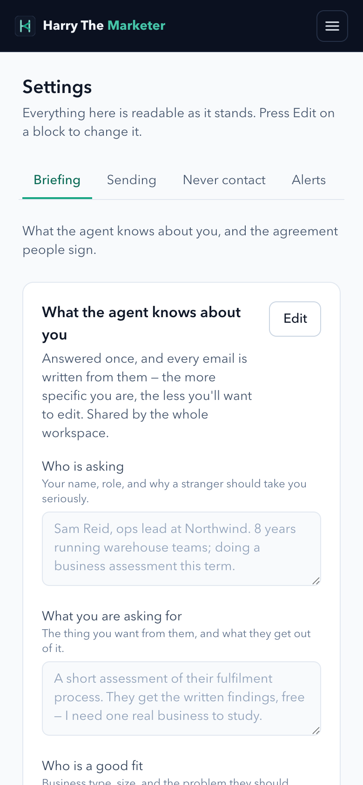
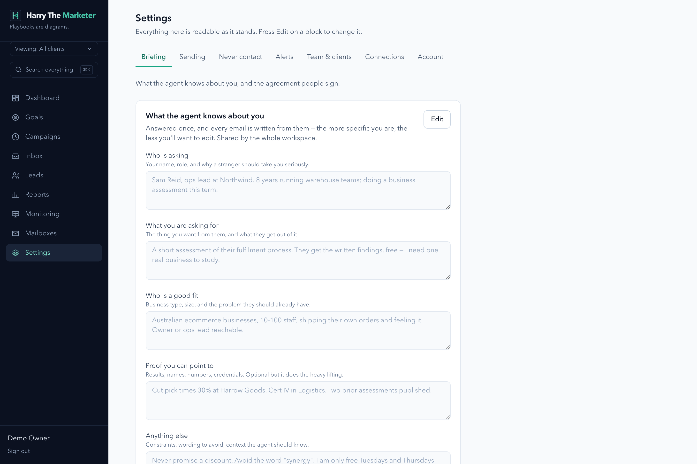

# webhooks — visual verification

4 endpoint specs. Regenerate with `npm run gallery`.

> A capture proves the surface renders with real data. Whether each spec's
> acceptance criteria are met is the **Verdict** column, from
> [../../REQUIREMENTS-MATRIX.md](../../REQUIREMENTS-MATRIX.md).

## Captures

### Settings — clients, webhooks, suppression, providers

Never-contact list, webhook registry with its delivery log, agency clients, and the honest provider status.

**mobile**

**desktop**

## What the specs in this category are judged at

| Spec | Verdict | Notes |
|---|---|---|
| [Delete Campaign Webhook](../delete.md) | Not reviewed |  |
| [Get Webhook](../get.md) | Not reviewed |  |
| [Update Webhook](../update.md) | Not reviewed |  |
| [Create Webhook](../create.md) | Known gap — documented | Delivery, HMAC, SSRF re-check and auto-pause are solid; payloads carry envelope metadata only, not the documented per-event fields. Declared in README. |
