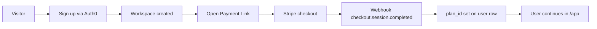

# Harry The Marketer — paid signup provisioning

**Goal board unit:** Paid signup provisions a workspace (`gmskf0xb5`)

## Flow (automatic when Stripe is configured)



1. **Sign up first** — Auth0 creates a `users` row (`/api/auth/login?screen_hint=signup`).
2. **Checkout** — Signed-in user calls `POST /api/billing/checkout` with `{ "plan": "starter" }` or opens the Payment Link from Settings (prefilled email).
3. **Pay** — Stripe hosted checkout (live Payment Link).
4. **Webhook** — `POST /api/billing/webhook` verifies signature, matches customer email to user, sets `plan_id` and `billing_status = active`.
5. **Verify** — `GET /api/auth/me` → `billing.planId`, `billing.status`.

## Stripe catalog (test sandbox — Harry The Marketer)

Account: `acct_1U2IIaD9tgkMFKlx` · prices in **USD** · Dashboard test mode.

| Plan | Monthly | Annual (2 mo free) | Payment Link (monthly) |
|---|---|---|---|
| Starter | $39/mo USD | $390/yr USD | `STRIPE_PAYMENT_LINK_STARTER` |
| Growth | $99/mo USD | $990/yr USD | `STRIPE_PAYMENT_LINK_GROWTH` |
| Scale | Contact sales | — | no link (Settings → Contact) |

**Promo codes** (enter on Stripe Checkout — Payment Links must allow promotion codes):

| Code | Discount |
|---|---|
| `Squadinstitlute` | 10% off forever |
| `BISM1` | 100% off forever |
| `HARRYFREE` | 100% off forever (general free access) |

Create or refresh codes in Stripe:

```bash
node scripts/stripe-promo-codes.mjs
```

Run again after switching to live keys (`sk_live_…`) before go-live.

**In-app:** Settings → Billing → Subscribe (opens Stripe hosted checkout) or Manage subscription (Customer Portal).

**Local webhook forward:**

```bash
stripe listen --api-key "$STRIPE_SECRET_KEY" \
  --forward-to localhost:8130/api/billing/webhook \
  --events checkout.session.completed,customer.subscription.deleted
```

Put the printed `whsec_…` into `STRIPE_WEBHOOK_SECRET`.

## Stripe setup (live go-live)

1. Recreate the same products/prices/Payment Links in **live** mode (or promote from test).
2. Set Render env vars:

| Variable | Example |
|---|---|
| `STRIPE_SECRET_KEY` | `sk_live_…` |
| `STRIPE_WEBHOOK_SECRET` | `whsec_…` |
| `STRIPE_PAYMENT_LINK_STARTER` | `https://buy.stripe.com/…` |
| `STRIPE_PAYMENT_LINK_GROWTH` | `https://buy.stripe.com/…` |

3. Add webhook endpoint: `https://harrythemarketer.com/api/billing/webhook`
   - Events: `checkout.session.completed`, `customer.subscription.deleted`

## Manual provisioning (pilot fallback)

If webhook is delayed or buyer paid before signing up:

1. Find payment in Stripe dashboard (email + amount).
2. Ensure user exists (invite to sign up if not).
3. Update workspace in SQLite or wait for webhook retry after signup:

```sql
UPDATE users SET plan_id = 'starter', billing_status = 'active', billing_updated_at = datetime('now')
WHERE lower(email) = 'buyer@example.com';
```

4. Email buyer: receipt already from Stripe; send welcome with `https://harrythemarketer.com/login`.

## Test purchase + refund

1. Use Stripe test mode keys and test Payment Links in a staging Render service first.
2. For live go-live: one real purchase at published price → confirm `/api/auth/me` billing → refund in Stripe dashboard.
3. Log receipt ID in go/no-go sheet ([GO-LIVE-CHECKLIST.md](./GO-LIVE-CHECKLIST.md)).

## Buy → receipt → access checklist

- [ ] Payment Link price matches pricing page
- [ ] Webhook secret set in Render
- [ ] Test buy completes
- [ ] User can sign in and see plan on `/api/auth/me`
- [ ] Refund processed
- [ ] Go/no-go logged
