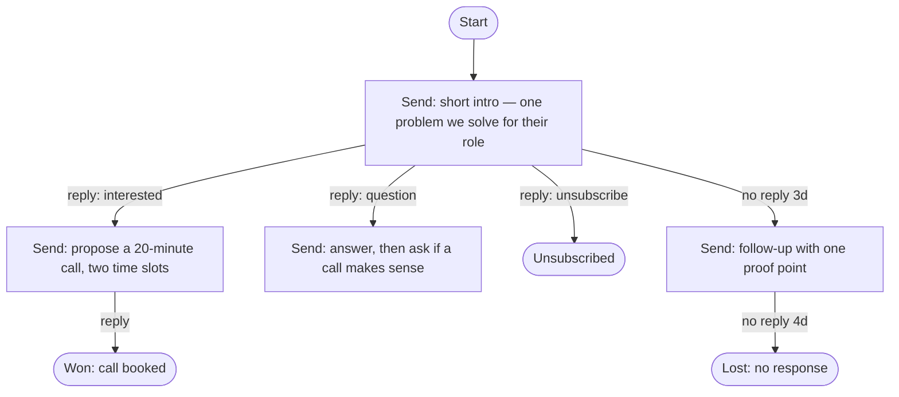

# Harry the Marketer

Outreach campaigns you can **draw**. Instead of a drag-and-drop sequence builder, every campaign's
playbook is a **Mermaid flowchart** you edit as text — and an AI agent executes it per lead against
the **live email chain**: it composes each email, sends it from your Gmail, watches for replies,
classifies their intent, and follows the matching edge in your diagram.



That diagram **is** the campaign. Change an edge, save, and the engine routes differently.

## The standing rule

**Nothing sends without your OK.** The agent researches the lead, writes the email, and picks the
moment — then stops and waits for a human. Approvals live in the **Inbox**, under *Needs your OK*:
read it, edit it if you want, hit send. Approving hands the email to the same engine path an
unattended send would take, so what you approved is exactly what goes out.

It is on by default, for existing workspaces too. Settings → Sending turns it off if you want the
agent to send unattended; a draft already waiting is still the email that goes, never a second one.
Invite your coach or assessor in Settings → Team and they can approve too.

Approving means *yes, send this* — not *send this instant*. The sending rhythm still picks the
minute, and the queue tells you which one ("Approved — goes to Priya around 2:40pm").

## What's inside

- **Revenue Goals ("don't make me think")** — type the outcome in plain English
  ("Generate 20 qualified meetings with Australian SaaS companies using Jira") and the AI extracts
  the target, builds the ideal customer profile, writes the playbook diagram, creates the campaign,
  scores every lead against the ICP with reasons, attaches the fits, and — with Autopilot on —
  launches and writes the first emails. Progress is measured from real won outcomes.
- **Approval queue** — every composed email parks in `drafts` until a human approves, edits or
  declines it. "Don't send" stops that lead in that campaign rather than quietly trying another
  angle. Who approved what, and whether they edited it, is in the activity trail.
- **The guided briefing** — Settings asks five questions (who is asking, what you're asking for, who
  is a good fit, your proof, anything else) plus a voice. The answers are composed into the one
  briefing string every prompt already reads (`shared/profile.js`), so the agent is briefed properly
  without anyone facing a blank box. A briefing typed by hand before the questions existed is kept
  until its owner answers one.
- **Honest outreach wording** — the composer is required to say who is writing and what is being
  asked in the first two sentences, to state what taking part involves, to invent nothing, and to
  close with an easy way to decline. Every send also carries a plain-text opt-out line, not just an
  HTML one.
- **The signed yes** — once a lead is interested the agent includes a link to a short, server-rendered
  agreement page (`/agree/:token`). They read what they're agreeing to, type their name, and click
  once; the name, timestamp and exact wording shown are stored. Default wording is written for you and
  editable in Settings. "Add agreement link" in any inbox thread pastes it into a manual reply.
- **Progress tracker** — every prospect's stage (not contacted → contacted → replied → interested →
  agreed → won, or lost / unsubscribed / bounced) is derived from messages, outcomes and signed
  agreements rather than stored, so it cannot drift. Shown per lead and as a click-to-filter strip
  on the Leads page.
- **Sending rhythm** — a running campaign does not empty itself into the world at once. One email at a
  time per mailbox with a randomised gap, only inside your working hours and days, and a new Gmail
  mailbox starts at 10 a day and works up to its limit over a fortnight. The gap is derived from the
  day's remaining allowance spread across the hours left, scattered ±50%. Randomness is *deterministic*
  (a hash of mailbox, day and count) so it is reproducible in tests and explainable in support, and
  never `Math.random`. Your timezone is taken from the browser rather than asked for. Sandbox mailboxes
  skip the clock and the gap so testing still takes seconds — the daily limit always applies. When a
  campaign is holding, its page says why and when the next email goes (`server/pacing.js`).
- **Send controls** — every lever over *when* a message may leave, resolved by one function
  (`server/gates.js`) that every screen and the engine both ask, so no two of them can disagree about
  why sending has stopped. The gates run in a fixed order — refusals, consent, the recipient, the
  calendar, volume, spacing — and the first one to block is the one you are told about, with a
  sentence and, wherever it is knowable, the minute it clears.

  Two rules hold the whole thing together. **A narrower scope may only restrict a wider one**: a
  plan's hours are intersected with the workspace's and can never extend them, so the workspace
  settings are a real ceiling rather than a suggestion. And **hard quiet hours** (06:00–21:00 in the
  recipient's timezone, tightenable but not looser) clamp every window anyone draws, which is what
  makes the rest safe to hand to a user.

  The levers: several windows a day and different hours on different days; blackout dates; start and
  end dates; the recipient's own clock; daily caps across the workspace, per plan and per hour; a
  share of the day's allowance reserved for follow-ups so first approaches cannot starve replies; a
  cooling-off period before the same *person* is approached again and a cap on how many people at one
  *company* hear from you in a week, both counted across every plan and every channel
  (`server/touches.js`); one channel per person per day; approvals that go stale; a reply that
  arrives after an approval; automatic brakes when bounces climb; and a hold button at every scope —
  workspace, plan, mailbox or one person — each carrying who placed it and why (`server/holds.js`).

  Settings → Send controls also answers the question the settings themselves cannot: *given all of
  this, when do the next twenty emails actually leave?* The preview replays the real resolver
  forward rather than a simplified copy of the rules, which is the only way it stays honest as levers
  are added. Rules are stored per scope and merged at read time (`server/send-rules.js`); every
  change is on the record.
- **Smart follow-up timing** — `no reply 3d` is the author's intent, not a law of physics. A lead who
  clicked a link is followed up sooner; one who is out of office waits longer. Adjustment is bounded
  to half-to-double, applies only to `no reply` edges (never a fixed `after Xd` wait), ignores
  "never opened" unless open tracking has demonstrably worked on that campaign, and writes its reason
  into the activity trail. Each lead also carries a fixed ±15% offset, so a hundred leads queued
  together are not all chased at the same minute three days later. Nothing to configure.
- **Slack & Teams alerts** — paste one incoming-webhook URL in Settings; Harry works out which
  service it is and sends the right payload shape. Pings on replies, emails awaiting approval, leads
  needing a decision, and signed agreements. Failures are telemetry, never a blocked send.
- **Google Sheet sync** — one button creates a spreadsheet in your Drive and keeps it filled in with
  every prospect and their stage. Because Harry creates the file, the only Google scope needed is
  `drive.file` (non-sensitive — it covers app-created files only). One-way: edits in the sheet are
  overwritten on the next push and never change a campaign.
- **AI qualification** — every lead scored 0-100 against a goal's ICP with plain-language reasons
  ("Matches signals: jira, saas", "Decision-maker title: Head of Operations"). Unknown data lowers
  confidence; it never fabricates.
- **Company research agent** — with an API key set, Claude searches the web and builds a knowledge
  profile per lead (situation, likely pain, trigger, opportunity, personalization hooks). The engine
  researches automatically before the first email; profiles are visible and refreshable on the Leads page.
- **Auth** — Auth0 (OIDC authorization-code flow) with a local dev-login fallback while Auth0 is unconfigured
- **Mailboxes** — connect Gmail accounts via Google OAuth (send + read), daily send limits, health;
  plus **sandbox mailboxes** that record sends locally and let you simulate replies (full E2E without credentials)
- **Leads** — CRUD, CSV import with column mapping + dedupe, unsubscribe handling
- **Campaigns** — Mermaid playbook editor with live render and server-side validation (launch is blocked until the playbook is valid, a mailbox is picked, and leads are attached)
- **Engine** — ticks every 20s (and on demand): sends at `Send:` nodes, waits at branch points, pulls
  new Gmail replies, classifies intent with Claude, follows the matching edge, honors `no reply Xd`
  timeouts, `Wait:` nodes, and terminal outcomes (Won / Lost / Unsubscribed)
- **Inbox** — every reply across campaigns with intent chips, thread view, manual reply, reclassify-and-reroute
- **Dashboard** — KPIs, engine heartbeat, Action Center (every lead parked for a human decision, with resume),
  14-day sent/replies chart, full agent activity trail
- **Reports** — pipeline funnel with stage conversion, per-campaign rates (reply/interested/win/unsubscribe),
  reply-intent breakdown, mailbox load, 30-day series, and a Learning section that attributes every reply
  to the playbook step that earned it and says which steps to lean into or rewrite
- **Monitoring** — end-to-end health of every hop in the pipeline, refreshed live: component checks
  (API, database, engine, AI agent, auth, Gmail, mailboxes, campaigns, lead pipeline), success factors
  graded against cold-outreach benchmarks (reply/interested/win/open/unsubscribe/bounce rates), goal
  progress, engine tick durations, an AI call log with latency and failures, delivery telemetry per
  mailbox, and an incident feed. Backed by a self-pruning `telemetry` table written by the engine,
  the AI layer, and the mailer (`GET /api/monitoring`)
- **Meeting booking link** — set your scheduler URL (cal.com, Calendly, etc.) in Settings and the agent
  includes it whenever it proposes a call
- **Email tracking** — every outgoing email carries an open pixel, signed click-through links, a one-click
  unsubscribe footer, and a List-Unsubscribe header. Open/click rates appear in Reports and per-message in
  thread views; the unsubscribe page finishes the lead everywhere. Note: recipients outside this machine can
  only hit tracking URLs if APP_URL is publicly reachable (deploy or tunnel for production use).
- **AI playbook generation** — "Generate with AI" in the campaign editor designs the whole Mermaid diagram
  from a brief plus the campaign's linked goal and your business context; every generated diagram is
  validated before it reaches the editor, and campaigns can be linked to goals directly from the editor
- **Node performance** — inside each campaign: emails sent and current leads per diagram node, so you can see
  exactly where the playbook converts and where leads sit
- **Team** — invite members by email (Settings). When they sign in with that address they share the workspace:
  same leads, campaigns, mailboxes, inbox, and reports. Owner manages membership.

No API key? The agent falls back to deterministic templates + a keyword classifier so everything
still works — the dashboard shows which mode is active.

## The public website

The app now sits behind a full marketing site. Routes split three ways:

| Path | What it is | Auth |
|---|---|---|
| `/` `/product` `/pricing` `/security` `/about` `/contact` | Marketing site (React, in the same SPA) | public |
| `/privacy` `/terms` `/acceptable-use` `/dpa` `/sub-processors` `/cookies` | Legal pages, **server-rendered** (`server/legal.js`) | public |
| `/agree/:token` | The agreement a prospect signs, **server-rendered** (`server/consent.js`) | public, unguessable token |
| `/login` `/signup` | Sign in / create an account | public |
| `/app/**` | The product (dashboard, campaigns, inbox, …) | session required |

Legal pages are server-rendered on purpose: Google's OAuth reviewers fetch
`{APP_URL}/privacy` and `{APP_URL}/terms` directly, and those must work without
JavaScript. They share the site's visual language so the seam is invisible.
The agreement page is server-rendered for the same reason from the other side:
recipients open it from an email client on an unknown device, and it must work
with no JavaScript and no account. Like the tracking links, it is only reachable
by outside recipients when `APP_URL` is publicly reachable.

**Editing the site.** Copy, pricing, FAQs, navigation, and per-route page titles all
live in one file — [`shared/site-content.js`](./shared/site-content.js) — imported by
both the React pages and the Express server. Change prices there and the pricing page,
the `/api/public/plans` endpoint, and the JSON-LD offers all move together.

> The published prices are a **starting proposal** benchmarked against the category's
> self-serve tier (Smartlead $39, Instantly $47, Apollo Basic $49). Nothing else in the
> codebase hardcodes them. Billing uses Stripe Payment Links when `STRIPE_*` env vars
> are set — see [PROVISIONING-RUNBOOK.md](./PROVISIONING-RUNBOOK.md) and [GO-LIVE-CHECKLIST.md](./GO-LIVE-CHECKLIST.md).

**SEO.** Crawlers and social scrapers do not run JavaScript, so per-route `<title>`,
description, canonical, Open Graph, Twitter card, and JSON-LD are injected into the HTML
shell before it is sent — by `server/site.js` in production and by a Vite plugin in dev,
both calling the same `shared/seo.js`. The client re-applies them on navigation.
`/robots.txt` and `/sitemap.xml` are generated from the same route table. Unknown paths
return a real `404` status, not a soft 404.

**Legal review.** The policy text describes what the code actually does, but the operator
details are placeholders until you set `LEGAL_ENTITY_NAME` and `LEGAL_JURISDICTION` in
`.env` — until then the pages say "to be confirmed" and a production boot warns about it.
Have counsel review before you rely on them commercially.

## The design system

One file decides how the whole product looks: [`web/src/index.css`](./web/src/index.css).
It is a token layer — product code writes ordinary Tailwind utilities
(`text-slate-500`, `border-slate-200`, `bg-accent-500`, `rounded-xl`, `text-lg`) and
`@theme` decides what those *mean*. That is why a palette or type change lands across
all ~110 components at once instead of file by file, and why you should change colours
and sizes there rather than reaching for a hex or a `text-[13px]` in a component.

Source of truth for the values: `Docs/Harry_Design System/Harry Redesign.dc.html`.

| | |
|---|---|
| Typeface | **Lexend** 300–700, self-hosted at `web/public/fonts/*.woff2` (variable font, latin + latin-ext). Self-hosted so the CSP stays `font-src 'self' data:` and no page load reaches a third party. Preloaded from `web/index.html`. |
| Type scale | 12.5 / 13.5 / 14.5 / 15 / 19 / 21 / 25 / 29 px, mapped onto `text-xs` … `text-3xl` (plus `text-md` = 14.5px for body copy) |
| Canvas | app surface `#F5F8FA`, cards white, subtle strips `#FAFCFD` |
| Rail | `ink-950` `#0B1622`, active row `ink-800`, borders `ink-700` |
| Neutrals | one blue-grey ramp, `slate-50` `#FAFCFD` → `slate-900` `#1B2A3D`; `border-line` `#EDF1F5` is the hairline *inside* a card |
| Brand green | `accent-500` `#0F9D6E` for surfaces and marks, `accent-600` `#0B7B56` for the primary button, `accent-700` `#0A6B4C` for green text and links, `accent-400` `#2FD79B` on the dark rail |
| Geometry | controls `rounded-lg` 7px, cards `rounded-xl` 10px, dialogs `rounded-2xl` 12px |
| Components | `.card` `.card-sub` `.input` `.readout` `.btn-primary` `.btn-ghost` `.btn-danger` `.tab-row`/`.tab` (top level) `.chip-row`/`.chip` (nested level) |
| React primitives | `PageHeader`, `Notice`, `Modal`, `Badge`, `EmptyState`, `ErrorState` in `web/src/ui.jsx`; `Tabs`, `Stat`, `Drawer`, `BulkBar` in `web/src/parity-ui.jsx`; `Panel`, `Field`, `StateChip` in `web/src/campaigns/shared.jsx` |

**Two deliberate departures from the design file, both for contrast.** White on
`#0F9D6E` measures 3.5:1, under AA for 14px text, so the primary button uses the
design's own hover green `#0B7B56` (5.2:1) and `#0F9D6E` survives everywhere text is
not sitting on it. And the design's muted text `#7C98B6` measures 3.0:1 on white, so
`slate-500` is `#5D7893` (4.5:1) in the same hue, with `#7C98B6`-weight greys kept at
`slate-400` for placeholders and decorative text where 4.5:1 does not apply.

## Run it

Requires Node ≥ 20.19 (a `.nvmrc` pins 22; `nvm use` if you have nvm).

```bash
npm install
```

```bash
npm run dev
```

- Web (dev): http://localhost:8131 (Vite, proxies `/api` and the public site routes to the API on :8130)
- Production: `npm run build` then `npm start` — one server on :8130 serving API + built app

`npm run build` also runs `scripts/postbuild.mjs`, which writes a pre-compressed
`<file>.gz` beside every asset (about 71% smaller). The server serves those directly, so
the bundles go out gzipped with no per-request CPU cost. Dynamic responses — the HTML
shell, JSON, XML, legal pages — are gzipped on the fly.

Behind a reverse proxy or PaaS, set `TRUST_PROXY=1` so `req.ip`, HSTS, and rate limiting
read the forwarded headers rather than the proxy's own address.

Tests (parser + engine + team workspace):

```bash
npm test
```

Data lives in `data/harry-the-marketer.db` (SQLite, WAL). Delete the file to reset.

## Configuration (.env)

Copy `.env.example` → `.env`. Everything is optional to start; each missing piece degrades gracefully.

### 1. Auth0 (real sign-in)

1. Create a free account at [auth0.com](https://auth0.com) → **Applications → Create Application → Regular Web Applications**.
2. In the app's **Settings**:
   - **Allowed Callback URLs**: `http://localhost:8131/api/auth/callback`
   - **Allowed Logout URLs**: `http://localhost:8131/login`
3. Copy into `.env`:
   ```
   AUTH0_DOMAIN=your-tenant.au.auth0.com
   AUTH0_CLIENT_ID=...
   AUTH0_CLIENT_SECRET=...
   ```
4. Restart. The login page now shows **Continue with Auth0**; dev login disappears automatically
   (force it back with `DEV_LOGIN=1` if you want both).

For production, add your real domain to the callback/logout URLs and set `APP_URL` accordingly.

### 2. Google OAuth (Gmail sending + reading) — Harry The Marketer

Google brands this OAuth app as **Harry The Marketer**. Gmail scopes are **sensitive**; until Google verifies the app, only **Test users** can connect. Full checklist: [GOOGLE-OAUTH-VERIFICATION.md](./GOOGLE-OAUTH-VERIFICATION.md).

1. Go to [console.cloud.google.com](https://console.cloud.google.com) → project that owns your OAuth client.
2. **APIs & Services → Library** → enable the **Gmail API**.
3. **OAuth consent screen** (Google Auth Platform):
   - App name: **Harry The Marketer** (not the old “Harry The Marketer” label)
   - Publishing status: **Testing** until verification is approved
   - Add every Gmail you’ll connect under **Test users** — otherwise Google shows *Access blocked: … has not completed the Google verification process*
   - Privacy / Terms: `{APP_URL}/privacy` and `{APP_URL}/terms` (served by this app)
   - Scopes: `gmail.send`, `gmail.readonly`, `userinfo.email`, `userinfo.profile`
4. **Credentials → OAuth client ID → Web application**:
   - **Authorized redirect URI**: `http://localhost:8131/api/google/callback` (or your production `APP_URL` + `/api/google/callback`)
5. Copy into `.env`:
   ```
   GOOGLE_CLIENT_ID=...apps.googleusercontent.com
   GOOGLE_CLIENT_SECRET=...
   ```
6. Restart, then **Mailboxes → Connect Gmail**. Each connected account stores a refresh token and
   sends through the Gmail API in its own threads; replies are pulled into the engine automatically.

> Cold-email hygiene: keep daily limits low (the default is 50/day per mailbox), warm up new
> mailboxes gradually, and always keep the unsubscribe edge in your playbooks.

> Production: when you need arbitrary Google users (not just test users), submit the OAuth app for
> Google verification using the privacy/terms URLs and the steps in `GOOGLE-OAUTH-VERIFICATION.md`.

### 3. Anthropic API (the agent's brain)

```
ANTHROPIC_API_KEY=sk-ant-...
```

With a key set, Claude (`claude-opus-5` by default, override with `ANTHROPIC_MODEL`) writes each
email from your **business context** (Settings), the lead's data, and the thread so far — and
classifies reply intent against your diagram's edge labels. Server-side refusal fallback is enabled
by default. Without a key: template emails with `{{firstName}}`-style merge fields + keyword classifier.

## Playbook syntax

Standard Mermaid flowchart. Conventions the engine understands:

| Element | Meaning |
|---|---|
| `S([Start])` | exactly one start node |
| `A[Send: <instruction>]` | the agent writes & sends an email from your instruction |
| `W2[Wait: 30d]` | pause, then continue (`m`/`h`/`d`/`w` units) |
| `D{Reply?}` | optional decision diamond (branch point) |
| `A -- reply: interested --> B` | follow when the reply is classified with this intent |
| `A -- reply --> B` | any reply (catch-all) |
| `A -- no reply 3d --> C` | timeout since the last email |
| `Won([Won: call booked])` | terminal; first word sets the outcome (Won/Lost/Unsubscribed) |

Intents are free-form — the classifier picks the best match from your edge labels plus the built-ins
(`interested`, `not interested`, `not now`, `question`, `unsubscribe`, `out of office`). A reply that
matches no edge flags the lead **needs attention** (never silently dropped); `unsubscribe` is always
honored even without an edge.

## Market coverage map

Where this platform stands against the full lead-gen / AI-SDR feature landscape, honestly:

| Category | Status |
|---|---|
| AI campaign builder from plain English (no filters, no forms) | Built — Revenue Goals |
| AI qualification with reasons + confidence | Built |
| AI company research / knowledge profiles | Built (needs `ANTHROPIC_API_KEY`; uses Claude web search) |
| AI personalization from research + thread + business context | Built |
| Sequences / engagement (email) | Built — Mermaid playbooks, the differentiator |
| AI inbox: classify, auto-reply, objection handling via playbook, human escalation | Built (escalation = Action Center) |
| Meeting booking | Scheduler-link level built; calendar availability/reschedule needs a calendar API |
| Campaign + pipeline analytics, learning loop | Built — Reports (funnel, rates, per-step reply attribution) |
| Team / workspace management | Built |
| Deliverability basics | Built (daily limits, unsubscribe honoring); warmup pools need external infra |
| Lead database / prospect discovery (Apollo, ZoomInfo class) | Needs a data-provider account — wire an API key the same way Google OAuth is wired |
| Contact enrichment / email finding + verification | Same — provider account (Apollo, Clearbit, NeverBounce) |
| Intent data (funding, hiring, tech installs) | Same — provider account (6sense, Bombora, or job-board scraping service) |
| LinkedIn automation | Not planned as automation (LinkedIn ToS risk); playbook steps can instruct humans |
| AI voice calling | Needs a telephony provider (Twilio + voice AI) |
| CRM sync (HubSpot, Salesforce, Pipedrive) | Needs CRM OAuth apps — same env-gated pattern as Gmail |
| Website visitor identification / chat widget | Out of scope for this codebase today |

The integration pattern for every "needs a provider" row already exists in the codebase: env-gated
credentials, graceful fallback, honest UI when unconfigured (see `server/google.js` as the template).

## Feature parity with SmartLead

The 210-endpoint backlog in [`Docs/README.md`](./Docs/README.md) is implemented. It is
**not** an integration with SmartLead — it is the equivalent capability built in Harry,
against Harry's own tables, on Harry's existing pages. The backlog's standing rule held:
no new navigation item was added anywhere. Clients, lead notes and prospect search — the
three surfaces it says Harry genuinely lacked — are a Settings section, a panel on the
lead detail, and a tab inside Leads.

```
server/parity/    one module per category, mounted onto the same router
  schema.js       32 tables + the column additions, applied by db.js on boot
  http.js         the 422-that-names-the-field, the non-leaking 404, keyset
                  paging, workspace-scoped lookups, all-or-nothing transactions
  providers.js    env-gated adapters for the three categories that need an
                  outside service, with bounded backoff and deterministic jitter
  index.js        the registry
```

**Deliberate divergences.** Every one in `Docs/README.md` is enforced in code and covered
by a test: suppression is unconditional and a request carrying `ignore_unsubscribe_list`
is refused rather than ignored; `campaigns/update-status` accepts `START`/`PAUSED`/`STOPPED`
and answers `ACTIVE` with a 422; `get-leads-history-bulk` refuses a null id list meaning
"all"; `clients/create` rejects `password`; a campaign is never created implicitly from a
name; nothing sends without an explicit confirmation; and Harry never accepts a card number.

**Known gaps, written down rather than discovered.** These are not design positions —
they are things the backlog asks for that are not built, recorded here so nobody has to
find them the hard way. Each carries its verdict in
[`Docs/REQUIREMENTS-MATRIX.md`](./Docs/REQUIREMENTS-MATRIX.md).

- **SMTP mailboxes are not stored.** `POST /api/mailboxes` with `type: SMTP` validates
  every documented field and then answers `501` with `stored: false`, discarding the
  credentials. `mailboxes.provider` is `CHECK (provider IN ('gmail','sandbox'))`, and
  there is no SMTP/IMAP client in the dependency tree, so `is_smtp_success` could only
  ever be faked. Gmail stays on OAuth.
- **Client API keys authenticate nothing.** They mint, hash, list and revoke correctly,
  but `resolveClientApiKey` has no production caller — there is no API-key request path.
- **Client permissions and allowances are recorded, not enforced.** Nothing reads
  `clients.permissions`, and an over-allowance writes an audit line saying sending is
  paused while nothing pauses.
- **Webhook payloads carry envelope metadata only** — not the documented per-event fields
  (`from_email`, `subject`, `campaign_name`, `sequence_number`).

**The three optional providers.** Inbox placement testing, prospect discovery and sending-
infrastructure procurement need an account with an outside vendor. Every route, table and
screen for them exists and works on Harry's own data; with no credentials set they report
`configured: false`, name the environment variables they need, and serve what is stored —
the same pattern `server/google.js` uses. Set `DELIVERABILITY_API_URL`/`_KEY`,
`PROSPECT_API_URL`/`_KEY` or `SENDERS_API_URL`/`_KEY` to turn each on. Nine of the 28
smart-delivery request contracts are unverifiable from the source documentation (six
publish an empty body, three contradict themselves on HTTP method); they are isolated in
one table in `server/parity/deliverability.js`, and the Monitoring page says so on screen
rather than implying certainty.

**Periodic work.** Several features are driven by nothing anyone clicks: releasing a
reply that was scheduled for later, firing a reminder when it comes due, announcing a task
that has just gone overdue, adjusting a mailbox's warm-up target from last week's spam
rate, and pulling mail that arrived in a connected mailbox but matches no lead. These live
in [`server/upkeep.js`](./server/upkeep.js) and run at the end of each engine tick, after
the campaigns, because a lead's own sequence is the point and this is housekeeping. Every
job absorbs its own failure, so a broken one can never stop a campaign from sending, and
every job claims its work with a conditional `UPDATE` so an overlapping tick cannot do it
twice. Covered by `tests/upkeep.test.js`.

**Outbound webhooks and chat alerts are wired at the source.** Every domain event already
passes through `logEvent`, so `server/db.js` publishes a subscription hook and
`server/index.js` subscribes once — rather than calling a dispatcher from forty call
sites. That is what makes a *new* event type deliverable the day it is added rather than
the day someone remembers. Slack/Teams alerts use the same hook with an explicit list of
what is worth interrupting someone for; everything else stays in the activity trail,
because an alert that fires for everything is an alert nobody reads.

**Suppression is enforced at dispatch.** `server/suppression.js` is read from the single
line in `server/mailer.js` that every send passes through, with the engine treating a
refusal as terminal rather than retrying it. That is what makes "checked immediately
before every send, in one place" (Settings → Never contact) true rather than aspirational
— every other entry point checks too, but only this one cannot be gone around. See
`tests/suppression.test.js`.

**Still not driven:** deliverability seed sends. The tests, runs and seed rows are
created, but the seed addresses come from the provider, so with none configured there is
nothing to send to. It becomes real work the day `DELIVERABILITY_API_KEY` is set.

### Finding your way around it

Two hundred endpoints went in behind the same nine navigation items, which is a
discoverability problem no individual screen can solve. Three things answer it:

- **One "Needs you" queue** at the top of the Dashboard. Approvals, leads parked on a
  decision, open tasks and due reminders used to be four answers on three pages; they are
  now one list, ordered by urgency, with the four sources as filters and the per-page
  views kept as drill-downs. A source that fails to load says so — it never shows `0`,
  because a silent zero here is how someone stops checking.
- **⌘K** searches leads, campaigns, segments, clients, labels, mailboxes and placement
  tests at once, and doubles as a jump-to-page.
- **A client lens** in the sidebar. `client_id` sits on campaigns, leads and mailboxes, so
  a client is a real partition rather than a preference. Selecting one scopes those three
  lists (applied once, in `web/src/api.js`, so no page can forget) and says so
  continuously — Reports and Monitoring stay workspace-wide and admit it, rather than
  quietly returning unfiltered numbers under a filter.

Reversible bulk actions offer an **undo toast** rather than a confirmation dialog.
Irreversible ones — anything that sends, unsubscribes, or deletes for good — keep their
confirmation, because undo is not a substitute for consent.

[`Docs/REQUIREMENTS-MATRIX.md`](./Docs/REQUIREMENTS-MATRIX.md) is the one place to
look for where any of the 210 endpoints stands: its route count, its acceptance
criteria and test-case totals, and a human `Status`/`Notes` pair. Regenerate with
`npm run matrix` — the mechanical columns are derived from the live Express
router, and the two judgement columns are read back in and preserved.

[`Docs/VERIFICATION.md`](./Docs/VERIFICATION.md) is the visual index: every
category has a `verification/` folder holding screenshots captured from the
running app, each paired with the specs it covers and the verdict those specs
are currently at. A picture proves a surface renders; it is not evidence a
requirement is met, and the folder says which is which.

Four commands worth knowing:

```bash
npm run routes
```

Prints every registered route and fails if one is unreachable — Express matches the first
layer that fits, so a parameterised route registered earlier can silently swallow a literal
one, which is invisible at boot and shows up later as a mysterious 404.

```bash
npm run test:e2e
```

Drives a running server over real HTTP with a real session: 129 checks covering the
divergences above and workspace isolation. Point it at another origin with `BASE=`.

## Architecture

```
shared/           imported by BOTH the server and the web app
  site-content.js copy, pricing, FAQs, nav, per-route page metadata
  seo.js          head construction, robots.txt, sitemap.xml, 404 detection

server/           Express API (ESM, no build step)
  playbook.js     Mermaid parser + validator (the DSL core)
  engine.js       tick loop: send → wait → classify → branch
  gates.js        may this message leave? one resolver, one ordered gate stack
  send-rules.js   the levers, stored per scope, merged by narrowing
  schedule.js     window/blackout/quiet-hour maths (pure, intersectable)
  holds.js        every stop button, at every scope, with a reason
  touches.js      who was contacted, when, by which channel — frequency caps
  send-controls.js  the send-controls API, including the schedule preview
  ai.js           Claude compose/classify + deterministic fallbacks
  google.js       Google OAuth + Gmail REST (fetch, no SDK)
  mailer.js       provider dispatch: gmail | sandbox, quotas, thread sync
  auth.js         Auth0 OIDC + signed-cookie sessions + dev login
  security.js     CSP + security headers, rate limiting, gzip
  site.js         SEO documents, OG/favicon assets, public API (plans, contact)
  legal.js        server-rendered privacy / terms / AUP / DPA / cookies
  routes.js       REST endpoints
  db.js           better-sqlite3 schema (users, mailboxes, leads, campaigns,
                  campaign_leads, messages, events, site_contacts, send_rules,
                  send_holds, touches)
  parity/         the SmartLead-parity backlog, one module per category

scripts/
  routes.mjs      route table + unreachable-route check (npm run routes)
  e2e-parity.mjs  end-to-end pass over a running server (npm run test:e2e)

web/              React 19 + Vite + Tailwind v4
  src/Root.jsx    top-level router: site | auth | /app
  src/site/       the marketing website
  src/auth/       /login and /signup
  src/App.jsx     the authenticated product shell (mounted at /app)
  src/pages/      product pages

tests/            node:test — parser, engine, send gates, goals, team, monitoring, site
```
